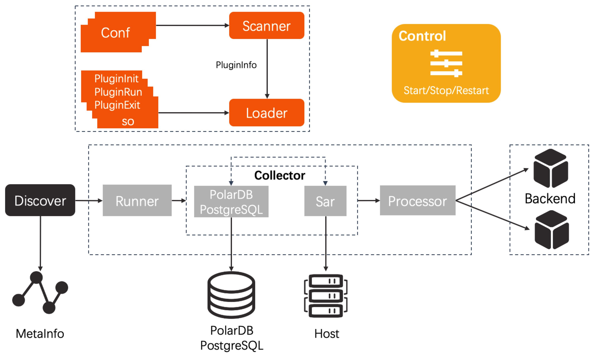

# 架构设计

## 设计目标
 * 灵活，业务接入方便；
 * 轻量级。资源占用低；
 * 鲁棒性强。
## 实现方式
 * 使用插件化机制，支持plugin编写插件代码。业务接入只需要编写三个函数(见Example)；
 * 提供插件的编排和复用机制，一个插件代码，可以通过配置被多个业务使用。业务可以快速的实现接入；
 * 鲁棒性强。每个实例的每个业务由独立的goroutine来进行采集，实现了各个采集线程的隔离，以及采集线程的失败重试等。

## 架构图
 

