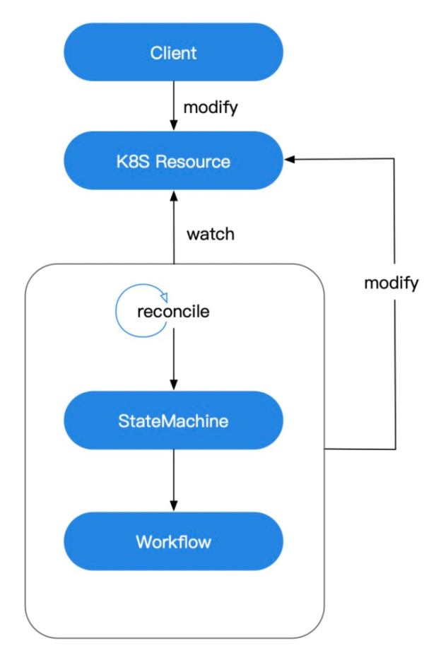
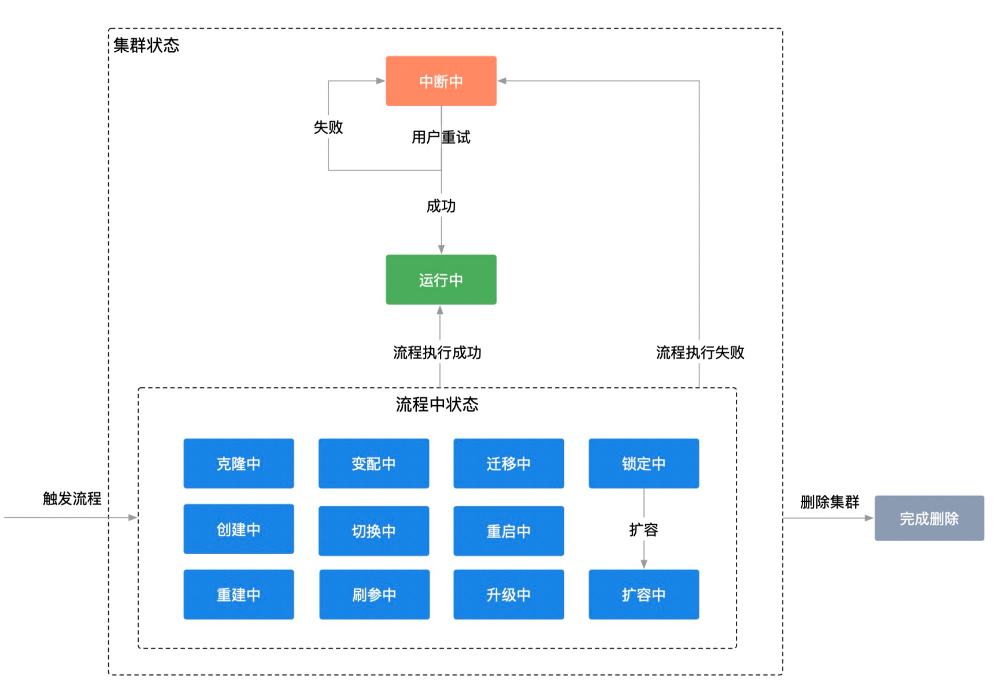

# 功能概述

PolarDB Stack 使用K8S作为底座，主要组件对象的生命周期管理基于K8S operator开发，基本工作流程如下：

1. 首先自定义一种K8S资源，然后由用户创建或修改该资源的一个实例；

2. 管控Operator监听到资源实例的变化，触发调协（调协是状态机的宿主）；

3. 调协中由状态机检测当前资源状态，判断是否触发了当前状态的某个动作（即判断是否需要进行状态转换）；

4. 执行该动作进入特定工作流，使用顺序工作流完成状态转换。

如果工作流正常执行完毕，资源实例会进入终态（稳态）。

由于工作流包含较多步骤，部分动作可能耗时较长，步骤执行失败时会进行重试，自动重试达到上限后，停止继续执行，进入中断状态等待人工介入。

数据库集群的生命周期管理是PolarDB Stack核心工作， 首先基于kubernetes CRD定义数据库集群数据模型，然operator会关注DB集群资源变化，资源发生变化时进入状态机，执行特定工作流，一系列步骤执行成功后，最终进入终态“运行中”。

上述逻辑和具体业务无关的，所以管控抽象出一套状态机和工作流引擎，以达到复用的目的。

把工作流定位为业务外观层，是相对不稳定的一层，比如：针对数据库引擎的不同输出形态，流程的组装方式会有很大差异。将稳定的核心业务实现放到领域层，工作流做成很薄的一层，调用领域层做业务组装。
