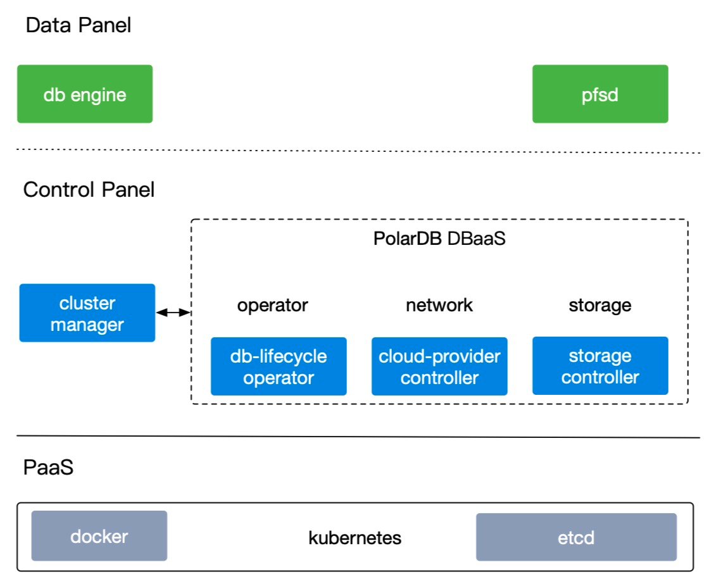

# 整体架构

PolarDB Stack整体架构如下图所示：

## 集群组件

PolarDB Stack集群组件整体分为数据面（Data Panel）、管控面（Control Panel）和Paas三部分。

- 数据面
  - PolarDB Engine：数据库引擎，分RW（支持读写）和RO（只读）节点和Standby节点
  - [PolarFS](../DeployPFS.md)：用户态文件系统

- 管控面
  - [CM（Cluster Manager）](../PolarDB-ClusterManager/Cluster-Management.md)：集群管理模块，包括节点拓扑维护，主备角色切换，节点状态汇报等
  - [LifeCycle Operator](../PolarDB-Stack-Operator/Lifecycle-Management.md)：负责数据库集群生命周期管理
  - [Storage Controller](../PolarDB-Stack-Storage/Shared-Storage-Management.md)：组件负责存储管理
  - [Daemon](../PolarDB-Stack-Daemon/Network-Management.md)：负责网络管理，节点内部维护、状态采集。

- PaaS：PolarDB Stack需要部署在Kubernetes上，系统组件及DB集群实例运行在Docker容器中

## 代码架构

1. 基础层的流程引擎、工具库分别抽出一个工程做实现。
2. 领域模型、外部依赖接口定义、应用服务层、适配器默认实现放到同一个工程，作为领域库。
3. operator 引用流程引擎、工具库和领域库。
4. 在operator中实现工作流、REST、monitor，这些逻辑实现很薄，只是对流程引擎和领域库的调用。如果默认适配器不能满足需求，operator还要针对adapter实现自定义逻辑。
5. operator 和领域库的应用服务层交互，防止领域逻辑外泄到应用。operator实例化adapter，并将其传入到service，继而注入到领域模型。

