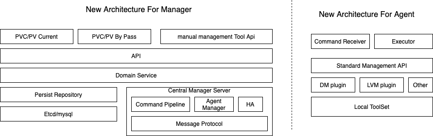
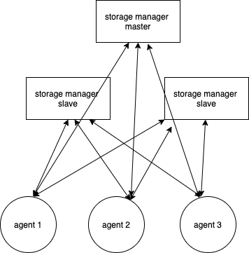

# 整体架构

## 逻辑架构

- API：系统内部的统一的API，对接上层适配层，主要是提供控制台管理相关的API，以及供DB管控使用的API（设置读写权限）。
- Domain Service：主要是抽象存储模型的两个核心Domain Entity： LUN、LV及接口PVC。
- Persist Repository：DM-Table（本地文件）， 持久化元数据到数据库。
- HA：负责sms-manager的3节点选主。
  - Command Pipeline：domain service 转化为 agent执行的command pipeline。
  - Message Protocol：protobuf 定义与agent的通信模型， 和通信协议（基于长连接，ack应答）。
  - Agent Manager：agent长连接管理。

- Agent侧：主机执行工具命令和执行类为主。

## 物理部署

- sms-manager：3节点部署， 一主多从服务
- sms-agent：daemon 部署每个计算节点

