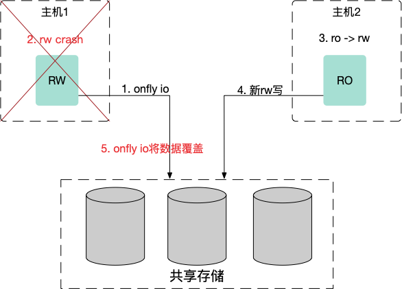
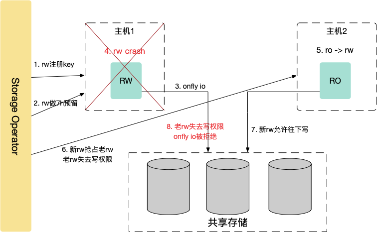

# 功能概述

共享存储管理模块为PolarDB上层管控系统提供：逻辑卷创建，扩容，文件系统格式化，读写切换，磁盘清理等功能，屏蔽底层存储差异对管控业务的干扰，提供一致的存储模型。通常我们会采用SAN存储后端磁盘做阵列，主机使用iSCSI/NVMe协议访问阵列侧的LUN，读写锁机制采用Persist Reservation，解决多主机多IT（Initiator-Target）链接的访问互斥问题，防止读写切换过程可能存在onflyio覆盖新数据的情况发生从而导致磁盘数据损坏。

- 共享存储架构下，进程或者节点之间通讯故障之后重新拉起，老I/O可能会覆盖新I/O，即onfly io问题：

​                            

- 存储管理模块作为协调者，利用存储阵列PersistentReservation锁机制解决，如下：

​                 
