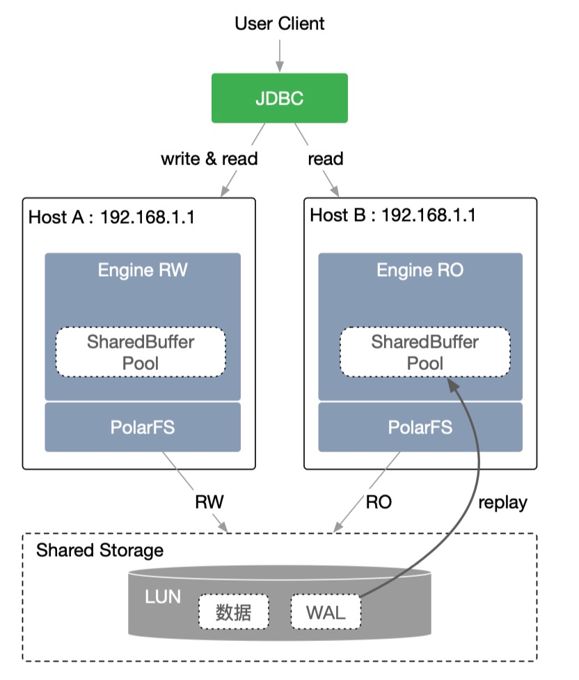

# 共享存储管理

PolarDB Stack采用存储和计算分离的架构，所有计算节点共享一份数据，提供分钟级的配置升降级、秒级的故障恢复、全局数据一致性。采用计算与存储分离的设计理念，满足业务弹性扩展的需求。各计算节点通过分布式文件系统（PolarFS）共享底层的存储（SAN），极大降低了用户的存储成本。PolarDBStack基于kubernetes和共享存储管理控制器为数据库引擎提供计算存储分离功能，基于kubernetes完成计算资源调度与分配，基于共享存储管理控制器完成存储的挂载与读写控制。计算资源申请释放升配降配可灵活独立进行， 在计算资源配置时，存储管理控制器提供存储资源的挂载读写控制等，实现计算资源与存储资源各自分离单独控制与共同协作。

