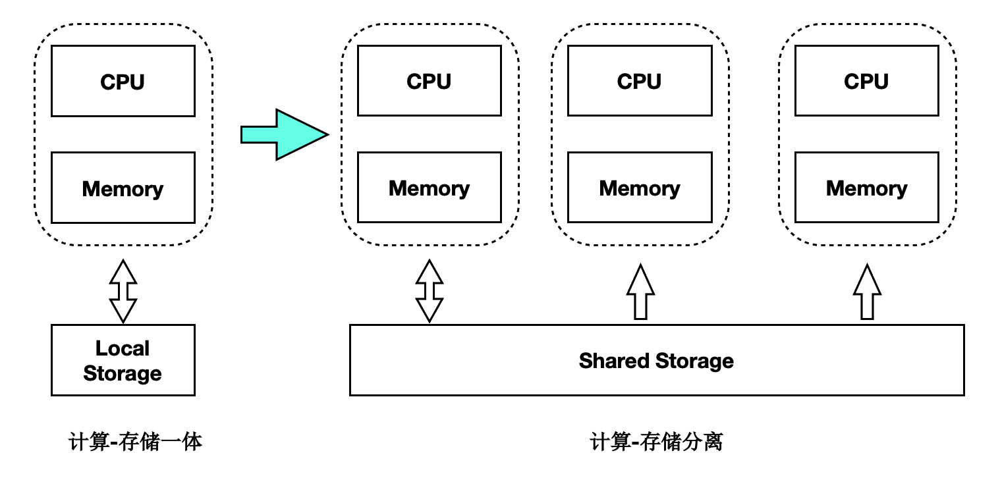

# 架构背景

## 传统数据库的问题

随着用户业务数据量越来越大，业务越来越复杂，传统数据库系统面临巨大挑战，如：

1. 存储空间无法超过单机上限。
1. 通过只读实例进行读扩展，每个只读实例独享一份存储，成本增加。
1. 随着数据量增加，创建只读实例的耗时增加。
1. 主备延迟高。

## PolarDB云原生数据库的优势

针对上述传统数据库的问题，阿里云研发了PolarDB云原生数据库。采用了自主研发的计算集群和存储集群分离的架构。具备如下优势：

1. 扩展性：存储计算分离，极致弹性。
1. 成本：共享一份数据，存储成本低。
1. 易用性：一写多读，透明读写分离。
1. 可靠性：三副本、秒级备份。