# CSN

## 功能简介

CSN（Commit Sequence Number）是一种新的事务快照机制，用于提升MVCC性能。与原生PostgreSQL使用XID事务号列表作为事务快照不同，CSN快照使用一个单调递增的64位整数值作为事务快照，既能加速事务快照生成，也能提升MVCC中的行可见性判断性能，并且支持PostgreSQL原生物理/逻辑复制和PostgreSQL原生快照导入/导出。

经测试，TPCC性能随着CPU核数的增加（32～48）能提高30%～60%。

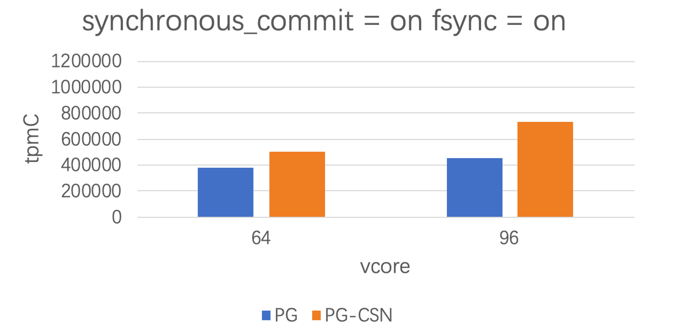

## 实现原理

### 快照管理

#### PostgreSQL XID快照

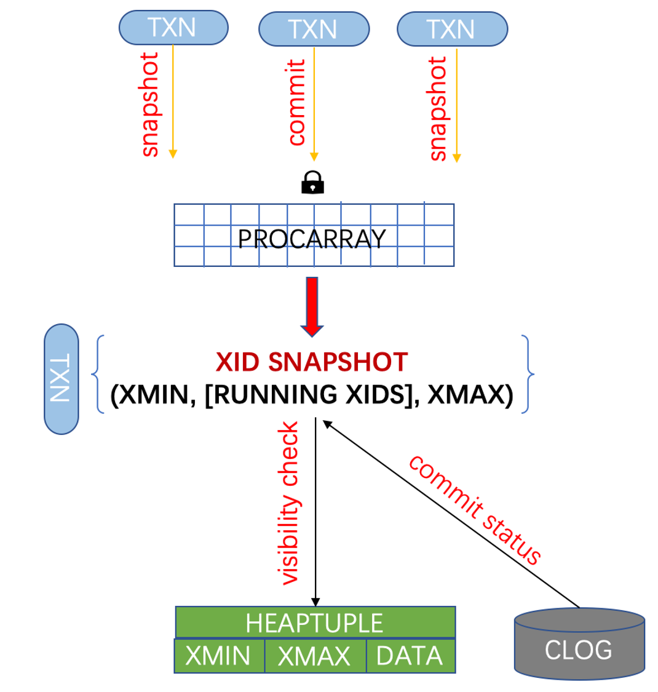

- XMIN：当前活跃事务中最小的事务号
- RUNNING XIDS：当前活跃事务号列表
- XMAX：当前已完成（提交或回滚）的所有事务中最大的事务号
- 可见性判断
  1. 元组的XMIN
      - 已提交且小于快照中的XMIN
      - 已提交且不在快照的活跃事务号列表中
  2. 元组的XMAX
      - 为空
      - 大于等于快照的XMAX
      - 在快照的活跃事务号列表中
      - 元组的XMAX已回滚


#### PolarDB CSN快照

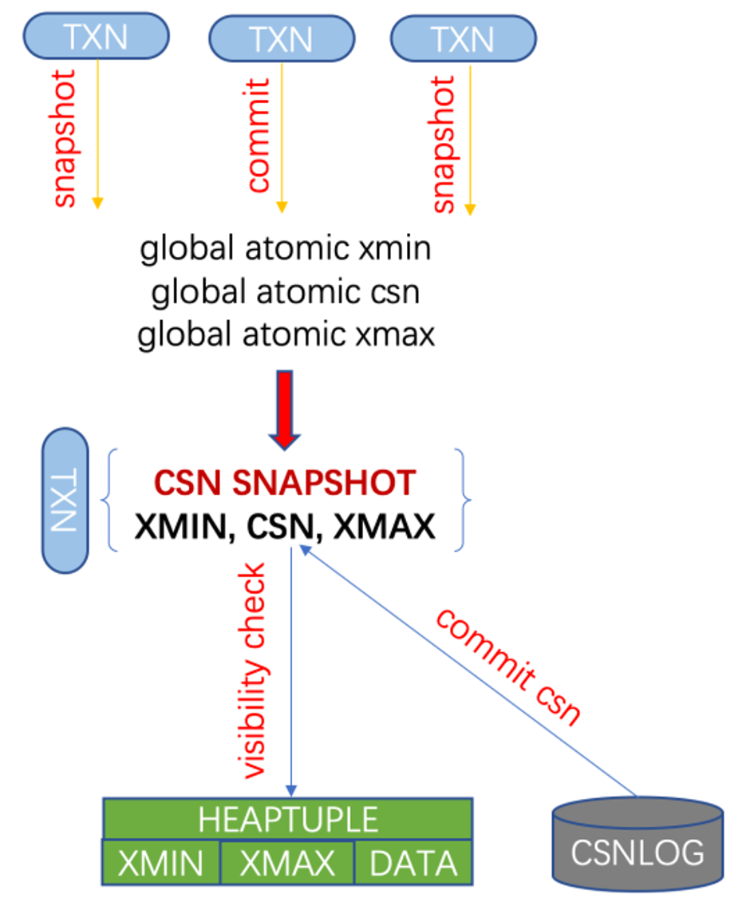

- XMIN：当前活跃事务中最小的事务号
- CSN：64位全局单调递增整数
- XMAX：当前已完成（提交或回滚）的所有事务中最大的事务号
- 可见性判断
  1. 元组的XMIN
      - 已提交且小于快照中的XMIN
      - 已提交且小于快照的CSN
  2. 元组的XMAX
      - 为空
      - 大于等于快照的XMAX
      - 元组的XMAX大于等于快照的CSN
      - 元组的XMAX已回滚


#### CSN/XID快照的等价性

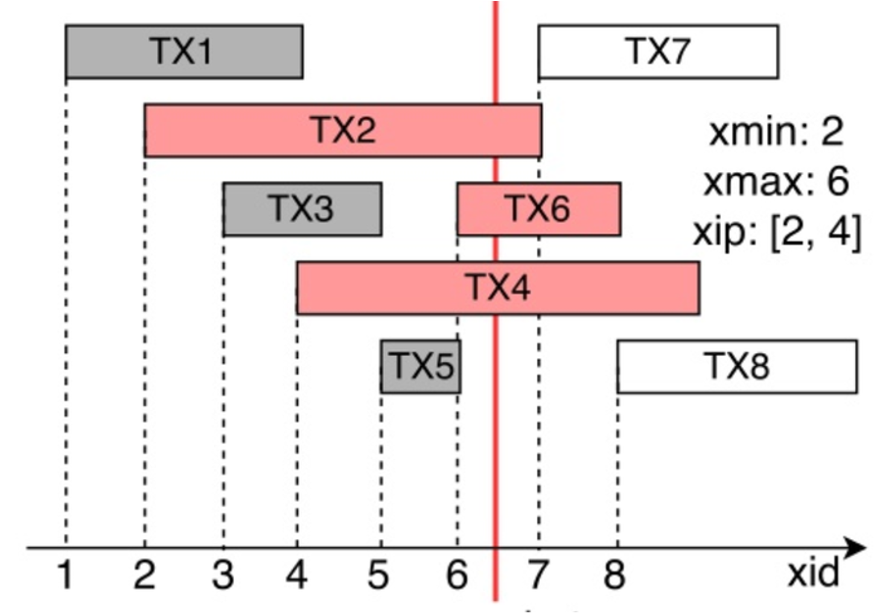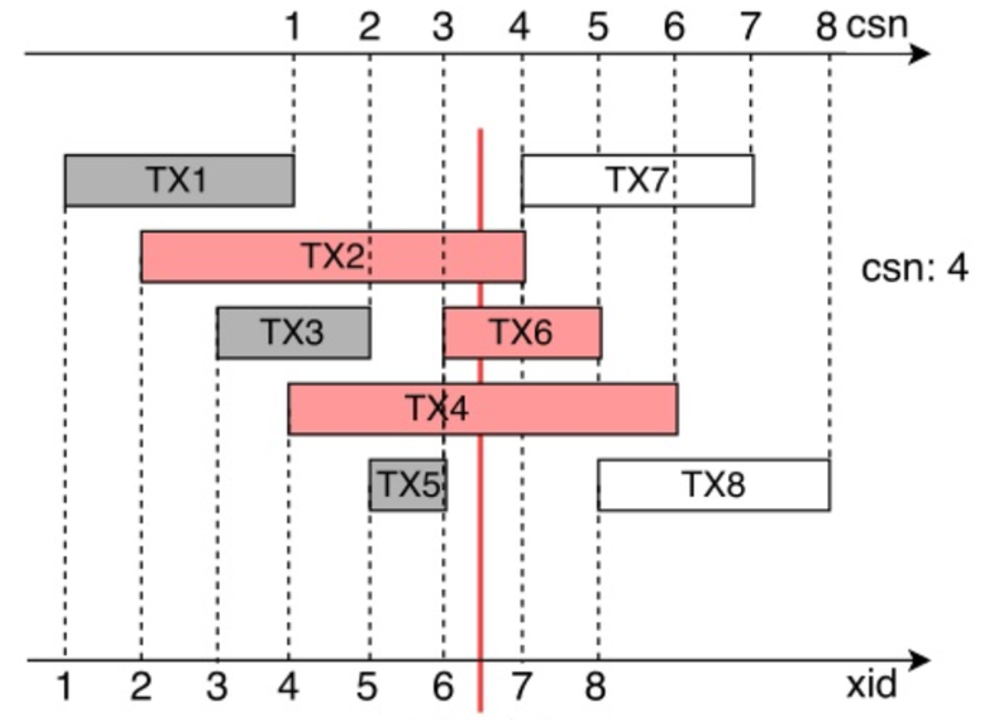

#### 混合快照

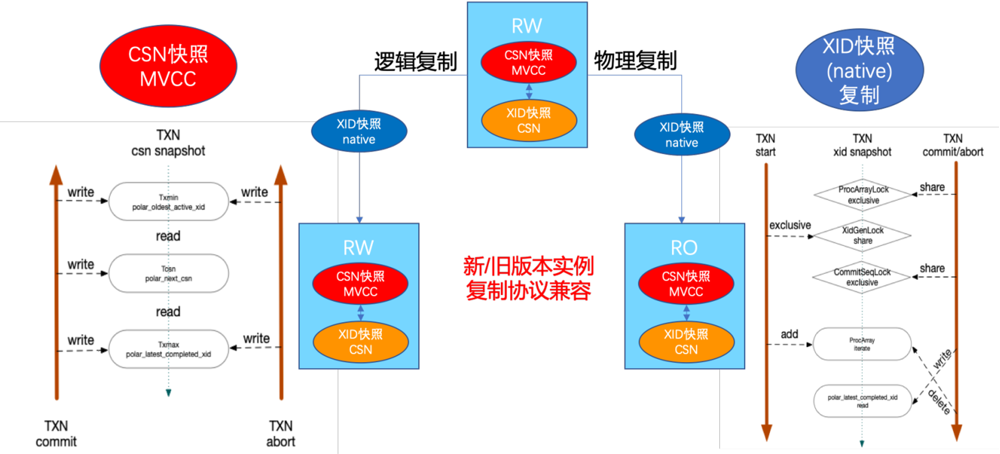

数据库实例运行过程中可生成三种快照，用途如下：

- XID快照：用于主备物理复制及逻辑复制

- CSN快照：用于MVCC

- 基于CSN的XID快照：用于缓解长事务性能

### 事务管理

#### 提交序/可见序

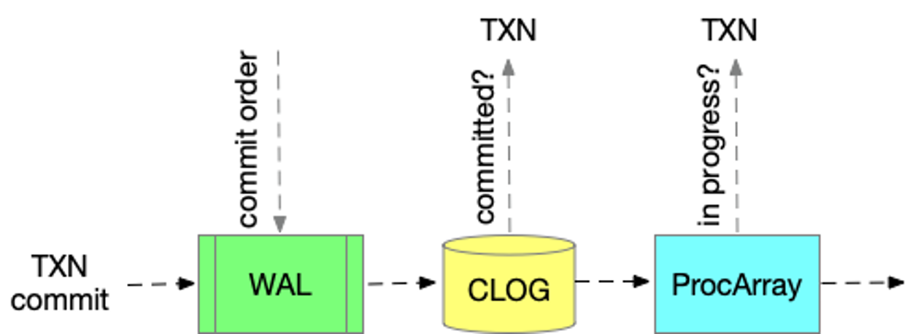

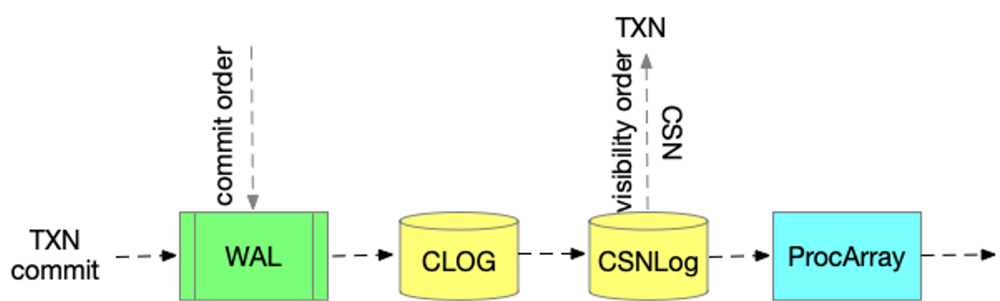

- 原生PostgreSQL由ProcArray的状态确定可见序
  1. 当前读可见性判断
      - 在ProcArray中检查事务是否活跃
      - 在CLOG中检查事务提交/回滚状态
  2. 快照读可见性判断
      - 在XID快照中检查事务是否活跃
      - 在CLOG中检查事务提交/回滚状态
- PolarDB由CSN确定可见序
  1. 当前读可见性判断
      - 在CSNLog中检查事务提交/回滚状态
      - 在ProcArray中检查事务是否活跃
  2. 快照读可见性判断
      - 在CSN快照中检查事务是否活跃
      - 在CSNLog中通过CSN值的比较检查事务提交/回滚状态
  


#### CSN持久化

为了保证WAL日志格式兼容，PolarDB CSN值当前没有写入事务提交WAL日志中，系统重启/崩溃恢复后CSN会重新计数，不支持外部一致性快照。

#### 长事务

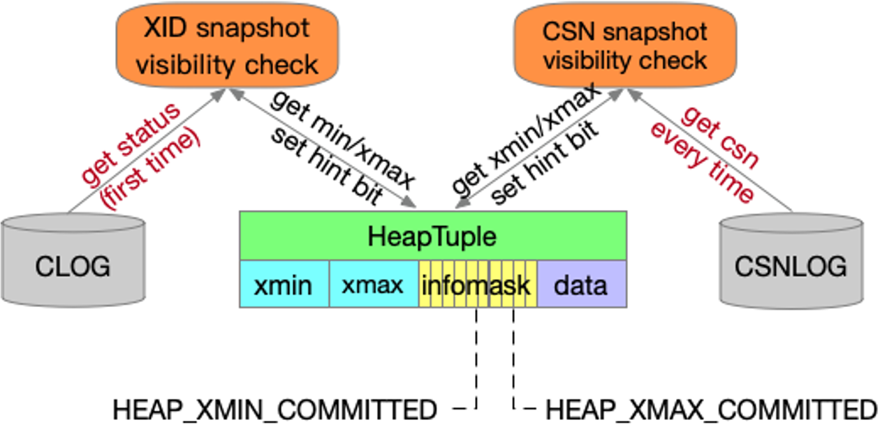

- XID快照可见性判断

    - 可见性判断时仅依赖xmin/xmax的事务状态是否提交/回滚

    - 仅在第一次访问元组时需要查询CLOG，后续的访问直接查看元组头中hint bit即可

- CSN快照可见性判断

    - 可见性判断时不仅依赖xmin/xmax的事务状态是否提交/回滚，还依赖提交事务的CSN值

    - 每次访问元组时都需要查询CSNLOG，因为CSN值无法存在元组头中


- 问题：长事务会导致正常事务快照中的xmin过小，导致在MVCC可见性判断中的过滤功能退化，从而大幅增加

CSNLOG的访问次数。

- 解决方案

  1. 及时杀掉长读写事务
       - 被长事务影响的其它进程的事务可能执行性能依然较慢，可以选择杀掉重新执行或等待执行完毕
       - 新开启的事务能够获得推进后的快照xmin，性能不会受到影响
  
  
  2. 在元组头上存储xmin/xmax的CSN值
       - PostgreSQL当前的事务号为32位，而CSN值为64位，需要增加元组头的大小
       - 与现有PostgreSQL实现相比会多占用存储空间
       - 可能会导致元组存储格式不兼容
  
  
  3. 优化CSNLOG的访问
       - CSNLOG并发访问优化
       - 增加进程级Cache，缓存XID与CSN的对应关系
  
  
  4. 切换到XID快照
       - 用户发现有长事务后，通过执行系统管理命令使系统进入XID快照模式
       - 使用事务或缓存快照的事务在此期间依然使用原有快照模式
       - 使用语句快照或未获取快照的事务在获取快照时直接由CSN快照生成XID快照
       - 长事务执行完毕后，通过执行系统管理命令使系统进入CSN快照模式
  


- 方案对比
  - 方案1对用户不友好（作为运维手段）
  - 方案2无法满足格式兼容的需求且会增加存储空间占用（后续版本使用该方案）
  - 方案3有效但不彻底，缓存大小/策略不好设定
  - 方案4在CSN转换为XID快照时可能有性能问题（当前版本使用该方案）


### 存储管理

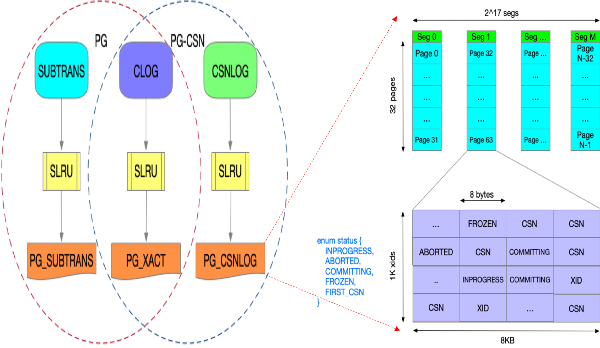

- CLOG（保留）

  存储事务的状态（IN_PROGRESS/ABORTED/SUB_COMMITTED/COMMITTED）

- SUBTRANS（去除）

  存储事务的父子关系

- CSNLOG（新增）

  存储事务的CSN值及父子关系

整体存储/缓存机制与PostgreSQL原生CLOG/SUBTRANS类似。

#### CSNLOG设计考虑

- 事务状态管理

  - XID/CSN映射
  - 部分替代CLOG
  - 替代SUBTRANS

- 缓存管理

  - SLRU
  - 并发控制
  - 更新原子性

- 生命周期管理

  - 创建时机
  - 截断时机（checkpoint/vacuum）

  - 回刷时机


### 兼容性考虑

#### WAL日志

- CSN增加的WAL日志均实现为XLOG资源类型
- 旧版本的实例读到新版本写入的XLOG类型的日志会忽略

- DTS等外围生态工具不会解析XLOG资源类型的WAL日志，保证了CSN版本对外输出的WAL日志的兼容

#### 二进制版本（原生PostgreSQL内核版本11.2）

非CSN版本可无缝升级为CSN版本。

##### 2PC兼容问题

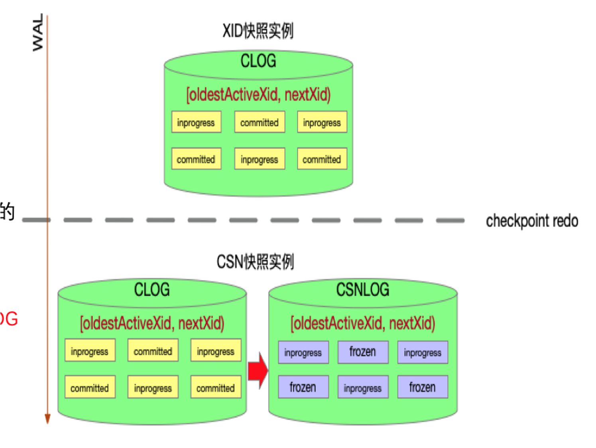

- prepare阶段

  事务状态信息会被持久化到WAL日志或PG_TWOPHASE目录中

- 系统恢复

  prepare阶段的事务被视为活跃事务导致oldestActiveXid小于nextXid

- 问题

  XID快照实例遗留的2PC事务在升级后的CSN快照实例中的可见性判断有误

- 解决方案

  根据CLOG中的事务状态初始化CSNLOG

#### 动态配置

可以通过配置参数重启实例打开/关闭CSN，不影响实例数据的正确性。

## 使用方法

要开启CSN快照，请修改以下配置参数并重启实例。

```
polar_csn_enable = true
```