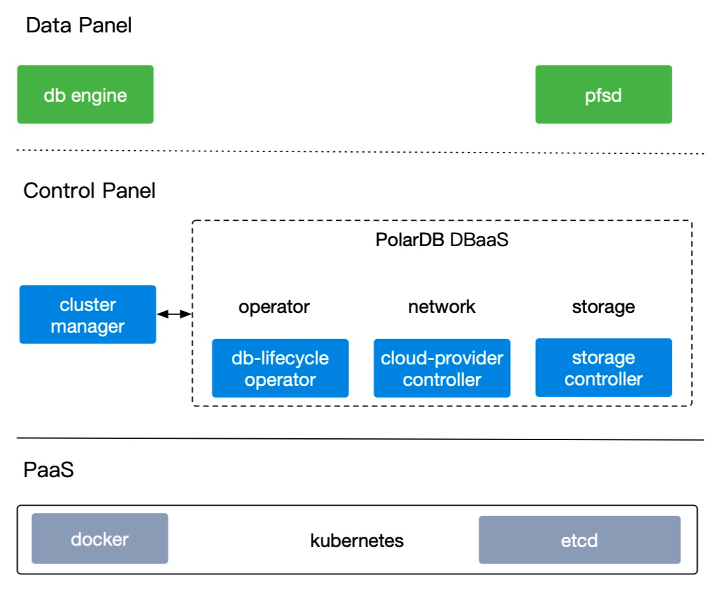

# 云原生

PolarDB for PostgreSQL基于Cloud Native设计理念，既融合了商业数据库稳定可靠、高性能、可扩展的特征，又具有开源云数据库简单开放、快速迭代的优势。此外，PolarDB for PostgreSQL还支持OSS外部表和冷热数据分离存储，可以无缝对接AnalyticDB、MaxCompute、OSS函数计算等。

PolarDB Stack 是是阿里云面向线下数据库市场，推出的轻量级 PolarDB PaaS 软件。通过 PolarDB Stack 可以一键部署 PolarDB for PostgreSQL 内核和 PolarDB-FileSystem。

PolarDB Stack整体架构如下图所示：

## 集群组件

PolarDB Stack集群组件整体分为数据面（Data Panel）、管控面（Control Panel）和Paas三部分。

- 数据面
  - PolarDB Engine：数据库引擎，分RW（支持读写）和RO（只读）节点和Standby节点
  - [PolarFS](../DeployPFS.md)：用户态文件系统

- 管控面
  - [CM（Cluster Manager）](../PolarDB-ClusterManager/Cluster-Management.md)：集群管理模块，包括节点拓扑维护，主备角色切换，节点状态汇报等
  - [LifeCycle Operator](../PolarDB-Stack-Operator/Lifecycle-Management.md)：负责数据库集群生命周期管理
  - [Storage Controller](../PolarDB-Stack-Storage/Shared-Storage-Management.md)：组件负责存储管理
  - [Daemon](../PolarDB-Stack-Daemon/Network-Management.md)：负责网络管理，节点内部维护、状态采集。

- PaaS：PolarDB Stack需要部署在Kubernetes上，系统组件及DB集群实例运行在Docker容器中

