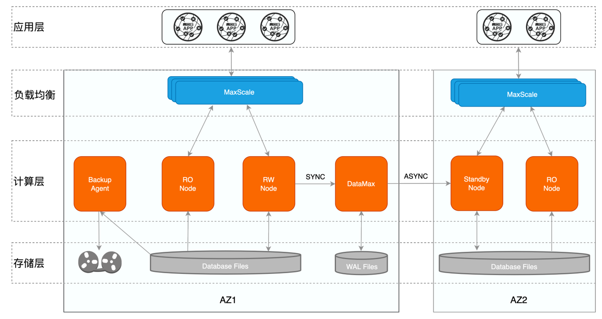
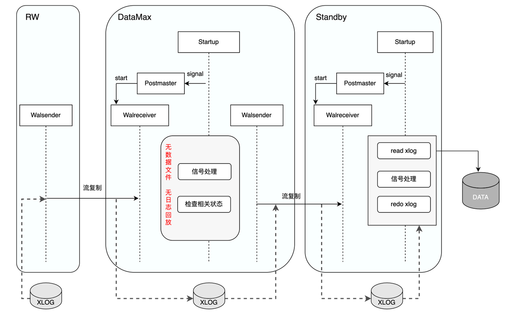
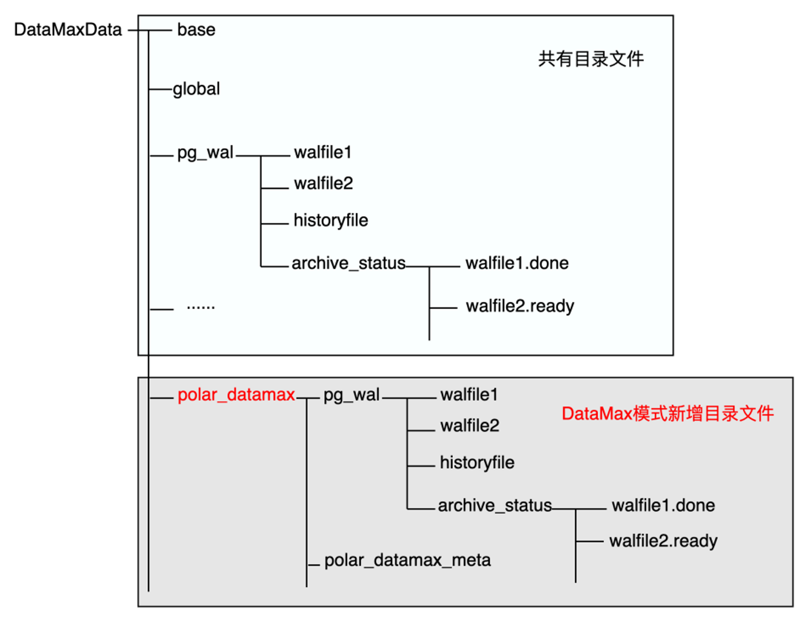
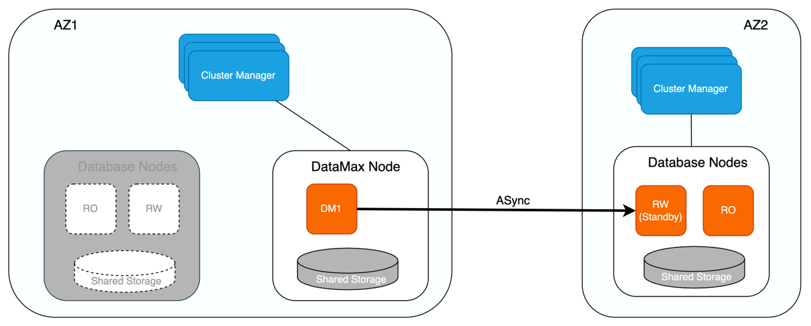
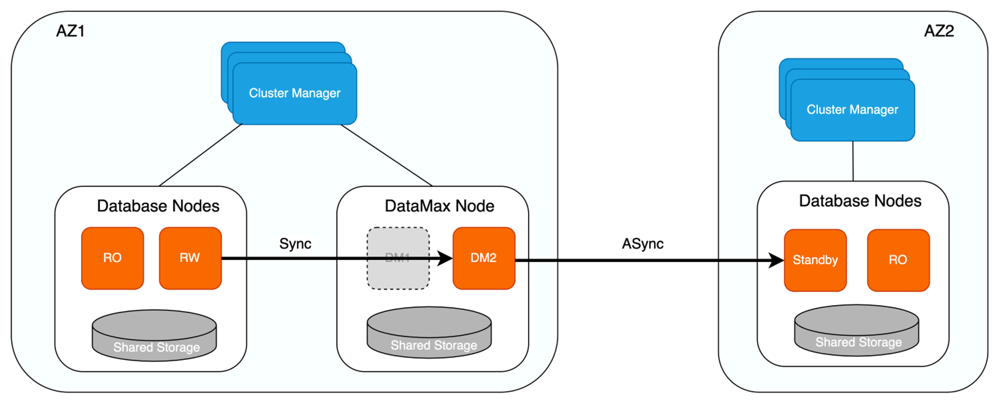

# DataMax

## 功能简介

在高可用的场景中，为保证无数据丢失，主库和备库之间需配置为同步复制模式。但当两者距离较远时，同步复制的方式会存在较大延迟，从而对主库的性能带来较大影响；异步复制对主库的性能影响较小，但其会带来不同程度的数据丢失。

PolarDB采用了共享存储一写多读架构，可同时提供AZ内/跨AZ/跨域级别的高可用。为了减少日志同步对主节点的影响，PolarDB引入了DataMax节点，在进行跨AZ甚至是跨域的同步场景时，DataMax节点可以做为主库的日志中转节点，在以较低成本实现零数据丢失的同时，降低日志同步对主节点的影响。

## 实现原理
### DataMax高可用架构

PolarDB基于物理流复制实现主库与备库之间的数据同步，主库与备库的流复制模式包含同步及异步两种：

- 异步模式：异步模式下，主库的事务提交仅需等待对应日志写入本地磁盘文件中后，即可进行之后的提交操作，备库的状态对主库的性能无影响。但异步模式下无法保证RPO=0，备库相较主库存在一定的延迟，若主库所在的集群出现故障，此时切换至备库可能存在数据丢失。

- 同步模式：同步模式包含不同的级别，可通过`synchronous_commit`参数进行设置，包括：

  - remote_write：该模式下，主库的事务提交需等待对应日志写入主库磁盘文件及备库的系统缓存中后，才能进行之后的事务提交操作。

  - on：该模式下，主库的事务提交需等待对应日志都已写入主库及备库的磁盘文件中后，才能进行之后的事务提交操作。

  - remote_apply：该模式下，主库的事务提交需等待对应日志写入主库及备库的磁盘文件中，同时备库已经回放完对应日志使其对备库上的查询可见后，才能进行之后的事务提交操作。

同步模式保证了主库的事务提交操作需等待备库接收到对应的日志数据之后才可执行，从而实现了主库与备库之间的零数据丢失，可保证RPO=0。但同时，该模式下主库的事务提交操作依赖备库的日志接收结果，因此若主备之间距离较远导致传输延迟较大时，同步模式会对主库的性能带来影响；极端情况下，若备库异常crash，此时主库则会一直阻塞在等待备库的过程中，导致无法正常提供服务。

针对传统主备模式下同步复制对主库性能影响较大的问题，PolarDB新增DataMax节点用于实现远程同步，该种模式下其对应的高可用架构如下所示。



其中：

- 一个数据库集群部署在一个可用区内，不同的集群之间互为灾备，主备模式保证跨AZ/跨域级别的高可用。

- 单个集群内为一写多读架构，读写节点共享同一份存储，有效降低存储成本，同时只读节点还可实现单个AZ内计算节点的高可用。

- DataMax节点与RW节点部署在同一个可用区内，具体：

  - DataMax节点只接收并保存主节点的WAL日志文件，并不对日志进行回放操作，不与RW节点共享数据文件，降低存储成本。

  - DataMax节点与RW节点数据不共享，两者的存储设备彼此隔离，以防止计算集群存储异常导致的RW节点与DataMax节点保存的日志都丢失。

  - DataMax节点与RW节点之间为同步复制模式，确保RPO=0，DataMax节点部署在距离RW节点较近的区域，通常与RW节点位于同一可用区，以减小日志同步对RW节点带来的性能影响。

  - DataMax节点将其自身接收日志发送至其他可用区的Standby节点，Standby节点接收并回放DataMax节点的日志实现与RW节点的远程数据同步，Standby节点与DataMax节点之间可设置为异步流复制模式，通过DataMax节点可分流RW节点向多个备份数据库传输日志的开销。

### DataMax实现

DataMax是一种新的节点形式，用户通过配置文件标识当前节点是否为DataMax节点。DataMax模式下，Startup进程在回放完DataMax节点自身日志之后，从PM_HOT_STANDBY进入到PM_DATAMAX模式。PM_DATAMAX模式下，Startup进程仅进行相关信号及状态的处理，并通知Postmaster进程启动流复制，Startup进程不再进行日志回放的操作，因此DataMax节点不会保存RW节点的数据文件，从而降低了存储成本。



如上图所示，DataMax节点通过WalReceiver进程向RW节点发起流复制请求，接收并保存RW节点发送的WAL日志信息，同时通过WalSender进程将所接收的RW WAL日志发送给异地的Standby节点，Standby节点接收到WAL日志后，通知其Startup进程进行日志回放，从而实现Standby节点与RW节点的数据同步。

DataMax下新增了polar_datamax目录文件，用于保存所接收的RW WAL日志，DataMax节点自身的WAL日志仍保存在原始目录下，两者的WAL日志不会相互覆盖，DataMax也可以有自身的独有数据。由于DataMax节点不会回放RW节点的日志数据，在DataMax节点因为异常原因需要重启恢复时就有了日志起始位点的问题。DataMax节点通过Meta元数据文件存储相关的位点信息，以此来确认运行的起始位点，具体：

- 初始化部署，在全新部署或者DataMax节点重搭的场景下，此时没有存量的位点信息，在请求流复制的时候需要表明自己是DataMax节点，同时还额外传递InvalidXLogRecPtr位点表明其需要从RW节点当前最旧的位点开始请求，RW节点在收到InvalidRecPtr的流复制请求之后，会开始从当前最旧的完整的WAL segment file开始发送WAL日志，并将其请求流复制的slot的restart_lsn设置为该位点。
- 异常恢复，从存储上读取元数据文件，确认位点信息后以该位点为起点请求流复制。



### DataMax下的集群高可用

如下图所示，增加DataMax节点后，若RW节点与RO节点同时异常，或存储无法提供服务时，则可将位于不同可用区的Standby节点提升为RW节点，保证服务的可用性。在将Standby节点提升为RW节点并向外提供服务之前，会确认Standby节点是否已从DataMax节点拉取完毕所有日志，待Standby节点获取完所有的日志信息之后才会将其提升为RW节点，由于DataMax节点与RW节点为同步复制，因此可保证该场景下RPO=0。

此外，DataMax节点在进行日志清理时，除了保留下游Standby节点尚未接收的WAL日志文件，还会保留上游RW节点尚未删除的WAL日志文件，避免RW节点异常后，备份系统无法获取到RW节点相较于DataMax节点多出的日志信息，保证集群数据的完整性。



若DataMax节点异常，则优先尝试重启进行恢复。若重启失败则对其进行重建，因DataMax节点与RW节点存储彼此隔离，因此两者数据并不互相影响，此外DataMax节点可同样采取计算存储分离架构，确保DataMax节点的异常不会导致其存储的WAL日志数据丢失。



类似地，DataMax节点实现了如下几种日志同步模式，用户可以根据具体业务需求进行相应配置：

- 最大保护模式
  - 该模式下，DataMax节点与RW节点进行日志强同步，确保RPO=0。
  - 若DataMax节点因网络或硬件故障无法提供服务，RW节点也会因此阻塞而无法对外提供服务。
- 最大性能模式
  - 该模式下，DataMax节点与RW节点进行日志异步流复制，DataMax节点不对RW节点性能带来影响，DataMax节点异常也不会影响RW节点的服务。
  - 若RW节点下的存储或对应的集群发生故障，则可能导致丢失较多数据，无法确保RPO=0。
- 最大高可用模式
  - 该模式下，当DataMax节点正常工作时，DataMax节点与RW节点进行日志强同步，即为最大保护模式。
  - 若DataMax节点异常，RW节点自动将同步模式降级为最大性能模式，保证RW节点服务的持续可用。
  - 当DataMax节点恢复正常后，RW节点则再次将异步模式提升为最大保护模式，避免日志数据出现较多丢失。

通过DataMax日志中继节点降低日志同步延迟、分流RW节点的日志传输压力，可在性能稳定的情况下，保障跨AZ/跨域高可用的RPO=0。

### 总结

PolarDB通过DataMax节点，在实现RPO=0的同时降低了该过程对主实例的性能影响。以上对DataMax的设计背景、DataMax具体实现、DataMax下的高可用架构及集群高可用实现进行了分析。除了本文介绍的高可用部署方式，DataMax还可应用于DMA架构中，使得数据库集群本身具备自主高可用或自运维的能力。

## 使用方法
### 节点配置

#### RW节点配置

在RW节点配置postgresql.conf，设置下游DataMax节点的不同日志同步模式：

- 最大保护模式，其中datamax1为RW节点创建的slot名称

```c
polar_enable_transaction_sync_mode = on
synchronous_commit = on
synchronous_standby_names = 'datamax1'
```

- 最大性能模式

```c
polar_enable_transaction_sync_mode = off
synchronous_commit = off
```

- 最大高可用模式
  - 参数`polar_sync_replication_timeout`用于设置同步超时时间阈值，单位为毫秒。等待同步复制锁超过此阈值时，同步复制将降级为异步复制。
  
  - 参数`polar_sync_rep_timeout_break_lsn_lag`用于设置同步恢复延迟阈值，单位为byte。当异步复制延迟阈值小于此阈值时异步复制将重新恢复为同步复制。
  
    ```c
    polar_enable_transaction_sync_mode = on
    synchronous_commit = on
    synchronous_standby_names = 'datamax1'
    polar_sync_replication_timeout = 10s
    polar_sync_rep_timeout_break_lsn_lag = 8kB
    ```
  


#### DataMax节点配置

最大保护、最大性能、最大高可用模式下DataMax节点配置相同：

-  recovery.conf
   - **必选**配置项：配置`polar_datamax_mode`参数开启DataMax模式。该配置与standby_mode及polar_replica配置互斥，当有互斥配置时会报错。
   
     ```c
     polar_datamax_mode = standalone
     recovery_target_timeline='latest'
     primary_slot_name='datamax1'
     primary_conninfo='host=[主节点的IP] port=5432 user=[$USER] dbname=postgres application_name=datamax1'
     ```
   


- postgresql.conf（**可选**配置项）

1. 若要在DataMax节点开启日志归档功能，需配置如下参数：

    ```c
     wal_level = replica
     archive_mode = always
     archive_command ='cp %p [archivedir]%f'
     polar_datamax_archive_timeout = 60000
    ```
  > 其中：
  >
  >   - 参数`wal_level`需配置为replica，logical逻辑复制目前DataMax尚未支持，设置为minimal时不启用archive_mode。
  >   - 参数`archive_mode`配置为always。
  >   - 参数`archive_command`为对应的归档命令，”%p“指代需要归档的WAL全路径文件名，“%f”表示不带路径的文件名，如cp %p /mnt/server/archivedir/%f。
  >   - 参数`polar_datamax_archive_timeout`为周期性进行日志归档的时间，默认值为60000ms。


2. DataMax节点若开启日志归档操作，可通过如下参数配置周期性清理已归档日志的时间，默认值为60000ms。

   ```
   polar_datamax_remove_archivedone_wal_timeout = 60000
   ```


### 节点部署

#### RW节点部署

- 参考[搭建基于NBD共享存储的实例](NBD-Instance.md)中的“PolarDB for PG内核编译部署”部分。
- 参考上一小节，在postgresql.conf中配置DataMax节点的日志同步模式（最大保护模式、最大性能模式、最大高可用模式）。
- 创建DataMax节点的replication slot，用于DataMax节点的物理流复制。

```c
$HOME/tmp_basedir_polardb_pg_1100_bld/bin/psql -p 5432 -d postgres -c "select pg_create_physical_replication_slot('datamax1');"
```

#### DataMax节点部署

- 内核编译

```bash
./polardb_build.sh
```

- 节点初始化：初始化DataMax节点时需要指定RW节点的system identifier

```c
#获取rw节点的system identifier
$HOME/tmp_basedir_polardb_pg_1100_bld/bin/pg_controldata -D $HOME/primary | grep 'system identifier'

#创建datamax节点，-i 参数指定的[primary_system_identifier] 为上一步得到的rw节点system identifier
$HOME/tmp_basedir_polardb_pg_1100_bld/bin/initdb -D datamax -i [primary_system_identifier]

# 共享存储初始化
sudo pfs -C disk mkdir /nvme0n1/dm_shared_data
sudo /home/[$USER]/tmp_basedir_polardb_pg_1100_bld/bin/polar-initdb.sh /home/[$USER]/datamax/ /nvme0n1/dm_shared_data/
```

- 打开postgresql.conf，增加以下配置项：

```c
port=5433
polar_hostid=2
polar_enable_shared_storage_mode=on
polar_disk_name='nvme0n1'
polar_datadir='/nvme0n1/dm_shared_data/'
polar_vfs.localfs_mode=off
shared_preload_libraries='$libdir/polar_vfs,$libdir/polar_worker'
polar_storage_cluster_name='disk'
logging_collector=on
log_line_prefix='%p\t%r\t%u\t%m\t'
log_directory='pg_log'
listen_addresses='*'
max_connections=1000
polar_enable_promote_wait_for_walreceive_done=on
```

- 启动，暂不配置recovery.conf，以可写节点的形式拉起实例

```c
$HOME/tmp_basedir_polardb_pg_1100_bld/bin/pg_ctl start -D $HOME/datamax
```

- 检查

```c
$HOME/tmp_basedir_polardb_pg_1100_bld/bin/psql -p 5433 -d postgres -c 'select version();'
```

- 创建管理账号及插件

```c
$HOME/tmp_basedir_polardb_pg_1100_bld/bin/psql -p 5433 -d postgres -c 'create user test superuser;'
$HOME/tmp_basedir_polardb_pg_1100_bld/bin/psql -p 5433 -d postgres -c 'create extension polar_monitor;'
```

- 关闭节点

```c
$HOME/tmp_basedir_polardb_pg_1100_bld/bin/pg_ctl stop -D $HOME/datamax
```

- 配置recovery.conf

```c
polar_datamax_mode = standalone
recovery_target_timeline='latest'
primary_slot_name='datamax1'
primary_conninfo='host=[主节点的IP] port=5432 user=[$USER] dbname=postgres application_name=datamax1'
```

- 启动

```c
$HOME/tmp_basedir_polardb_pg_1100_bld/bin/pg_ctl start -D $HOME/datamax
```

- DataMax节点检查
  - DataMax自身可通过polar_get_datamax_info() 接口来判断其运行是否正常
  
    ```bash
    $HOME/tmp_basedir_polardb_pg_1100_bld/bin/psql -p 5433 -d postgres -c 'select * from polar_get_datamax_info();'
    ```
  
  
     - 在RW节点可以通过pg_replication_slots查看对应slot的状态
  
       ```bash
       $HOME/tmp_basedir_polardb_pg_1100_bld/bin/psql -p 5432 -d postgres -c 'select * from pg_replication_slots;'
       ```