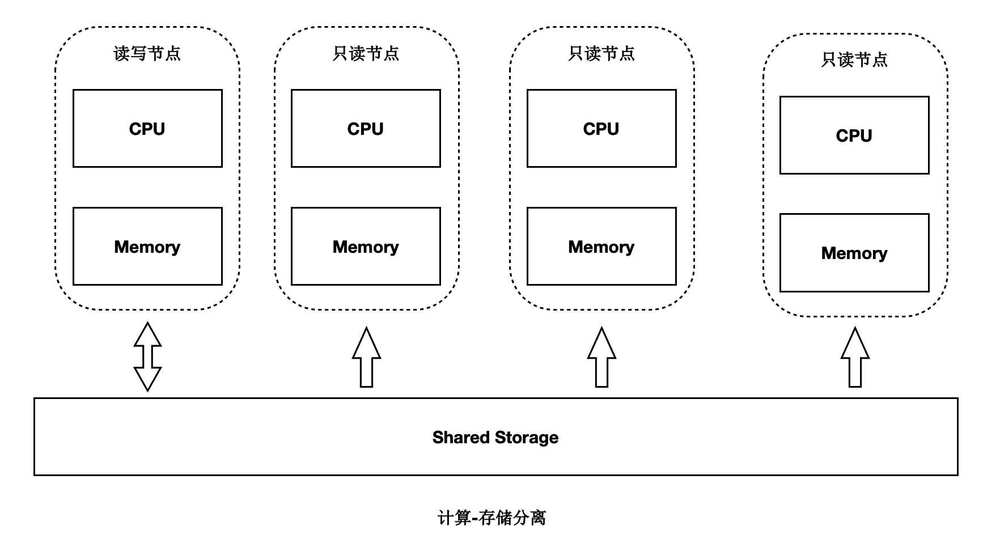
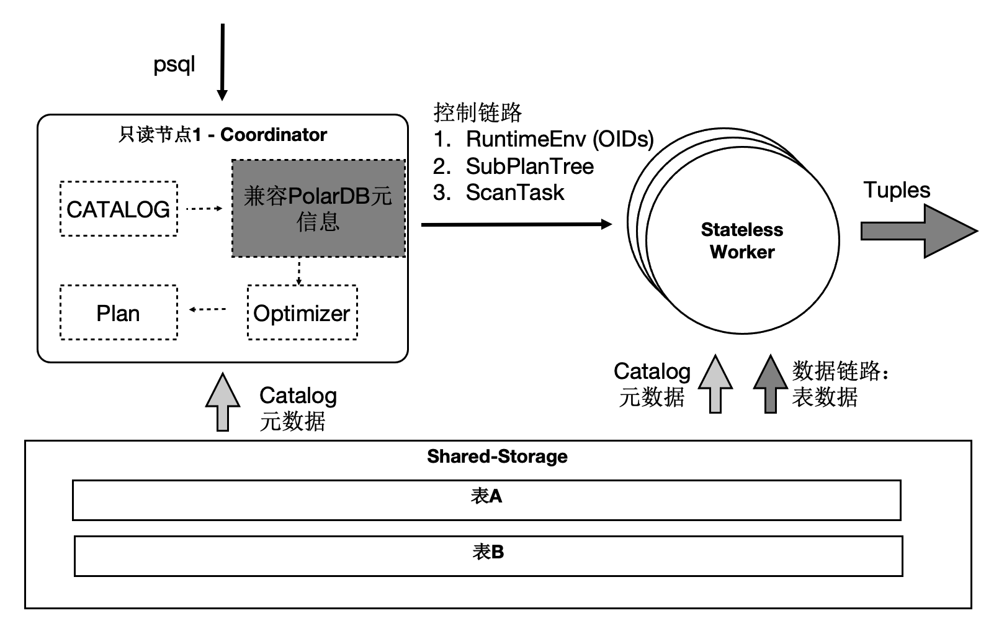

# 极致弹性

PolarDB是存储计算分离的设计，存储集群和计算集群可以分别独立扩展：

- 当计算能力不够时，可以单独扩展计算集群，数据无需复制。
- 当存储容量或 I/O 不够时，可以单独扩展存储集群，而不中断业务。

## SQL 级别弹性扩展

SQL 级别的弹性，在计算能力不足时，可随时增加参与 OLAP 分析查询的 CPU，而数据无需重分布。利用数据共享的特点，还可以支持云原生下极致弹性的要求：把 Coordinator 全链路上各个模块所需要的外部依赖存在共享存储上，同时 worker 全链路上需要的运行时参数通过控制链路从 Coordinator 同步过来，使 Coordinator 和 worker 无状态化。

因此：

1. SQL 连接的任意只读节点都可以成为 Coordinator 节点，这解决了 Coordinator 单点问题。
2. 一个 SQL 能在任意节点上启动任意 worker 数目，达到算力能 SQL 级别弹性扩展，也允许业务有更多的调度策略：不同业务域同时跑在不同的节点集合上。 

