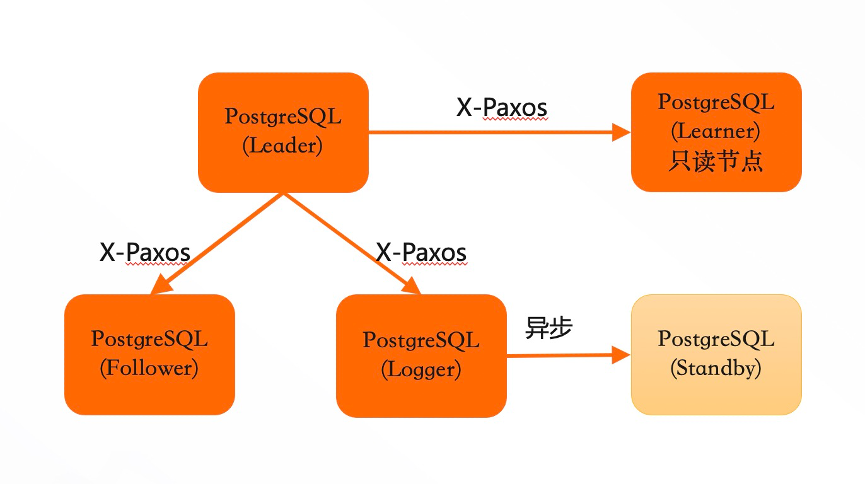
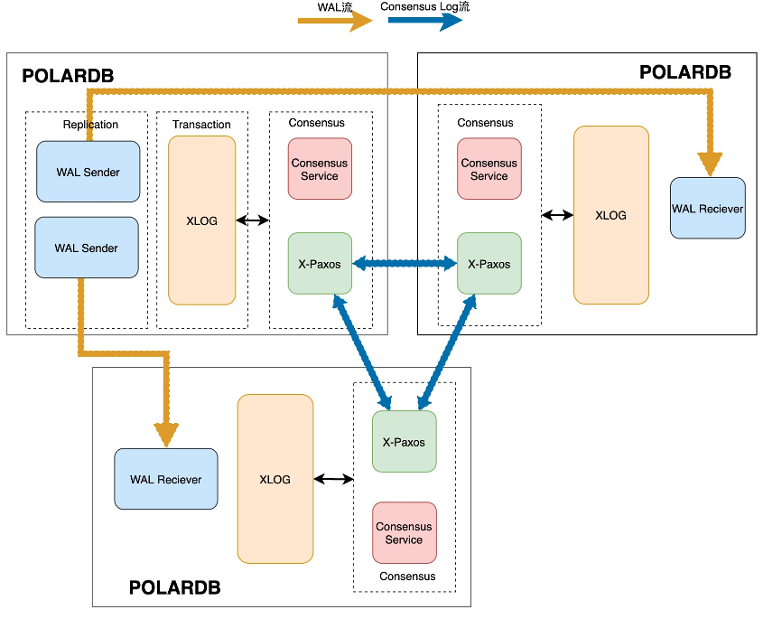
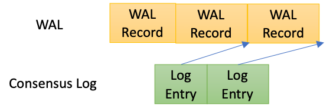
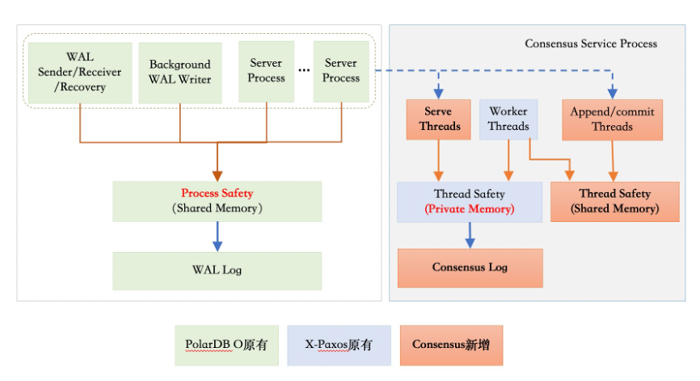
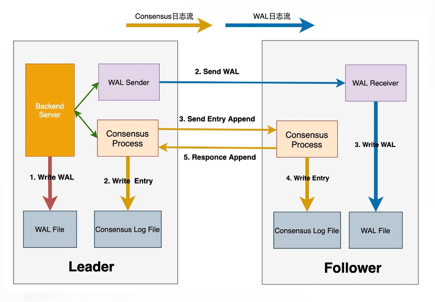
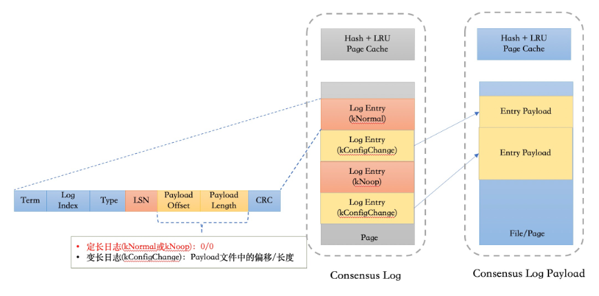
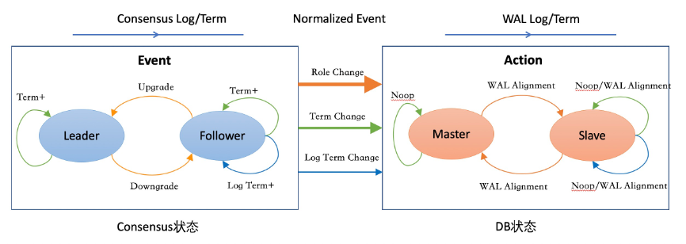

# 三节点高可用

## 功能背景

PostgreSQL原生的流复制支持异步、同步、Quorum Base的机制来同步WAL日志。同步复制的首要目标是保证不丢数据，但同时也会带来以下几个问题：

- 无法满足可用性的要求：当备库出现故障或者网络链路抖动，可能会影响主库的可用性或者主库的RT。

- 不具备故障自动切换的能力，没有探测主库的可用性和主备切换等机制。

- 旧的主库恢复后可能无法重新加入到集群里面来：比如当事务的WAL日志在主库上已经持久化成功，但是备库上仍未收到日志时，如果主库出现故障发生切换后，旧的主库无法直接加入到集群中来，必须要通过pg_rewind等工具对数据库状态进行对齐。

异步复制与同步复制相比，可用性和性能相对比较好，但最大的问题在于主备切换可能会丢失数据。

对于Quorum复制，看起来如果采用了多数派同步方案时，则可以保证不丢数据。但其实在一致性协议里，它除了多数派同步的方案之外，它本身还会有一些选主、日志一致性、集群在线变更等方面的逻辑，但是PostgreSQL本身Quorum复制里面，它并没有涉及到这些逻辑，所以从本质上来说，它其实并不是一个完整的RPO=0的高可用方案。

## 总体方案

总体设计上，三节点高可用方案采用PostgreSQL原有的异步流复制来进行物理WAL日志的传输，通过consensus协议来协商同步各个follower的同步位点，consensus协议所依赖的consensus log通过独立的日志流进行传输。

整个高可用集群是一个单点写入、多点可读的集群系统。其中，Leader节点可以作为单点的写入节点来对外提供读写服务，产生了WAL日志之后，它会向其他节点进行同步。Follower节点是不可写入的，它主要是接受来自于Leader的WAL日志，然后进行回放，最终对外提供一个只读服务。

三节点集群的主要特点包括：

- 保证集群数据的强一致性，也就是RPO=0。当多数派节点的WAL日志写入成功后，才认为日志提交成功。

- 自动failover。当发生failover之后，WAL日志会首先跟Leader对齐，然后再次从Leader上拉取日志，对齐主要是通过一致性协议来实现。

- 在线集群变更，就是可以在线增删节点（包括手动切换），这些操作不影响业务的正常运行。

同时，集群中还有其他两种角色：

- Logger节点：不存储数据，只保留实时日志。从Leader中拉取到日志之后，它不进行回放，作为日志持久化的多数派节点之一。主要目的是保证三个节点成本与主备基本相当。

- Learner节点：本身没有多数派的决策权，但是能提供只读服务。Leader节点在判断多数派节点的时候，并不考虑Learner节点。主要作用是可作为加节点的一个中间状态。当新加的节点相对于Leader节点延迟比较大的时候，可以先以Learner角色加入到集群同步数据，当数据追齐后再升级成Follower节点。其次，Learner节点可作为一个异地的灾备节点，当发生Leader切换之后，自动从新的Leader上同步日志。

在集中部署方面，可支持跨机房和跨域的部署，包括同机房三副本、同城三机房三副本、两地三机房五副本以及三地三机房五副本等部署方案。

对于跨域高可用，可以用Learner节点进行灾备，并不会影响Leader节点的可用性。

同时，三节点高可用复制可兼容PostgreSQL原生的流复制和逻辑复制，能保证下游的消费者不受影响。

## 架构原理

三节点高可用复制的基本原理主要包含三个方面：

- 通过原生的异步流复制方面来传输（或可称为同步）WAL日志。

- 根据X-Paxos协议以及consensus log entry来确定的多数派同步位点。

- 根据一致性协议自身节点状态的变化，来驱动数据库层面的状态变化。

在一致性协议中，日志提交位点是以consensus log为载体来推进提交位点。在三节点的双日志流实现中，我们引入了以下两个机制：

- 每一段WAL日志会生成一个相应的consensus log entry， consensus log entry中记录的是这段WAL日志的结束LSN。

- 在两个日志间引入了持久化依赖机制，当每个log entry持久化的时候，必须确保相应位点的wal日志已经持久化完成。

在引入了以上两个机制之后，如果一致性协议层面的Consensus Log已经提交，那么对应位点的WAL日志也已在多数派上节点上持久化完成。

### 进程/线程架构

由于PostgreSQL本身是多进程的架构，因而选择以X-Paxos为基础新引入了Consensus服务进程。

Consensus服务进程内部包含多个线程，主要包含以下几部分：

- 一致性协议相关线程：包括I/O线程和工作线程。I/O线程主要负责节点间的网络通信，工作线程主要负责协议的处理（比如发起选举、Follower节点要处理日志的Append请求）。可能需要发起选举的请求，主要是跟一致性协议、算法相关的处理逻辑。

- Append Thread：针对每一段的WAL日志生成Consensus log，并传递给X-Paxos进行同步。

- Advance Thread：推进WAL日志的提交位点，它主要从X-Paxos中获取当前Consensus log的提交位点，然后把它转化成LSN位点。另外，Advance thread同时会根据Consensus协议层的一些状态变化，来驱动PostgreSQL层进行状态变更。

- Command线程：处理客户端发起的集群变更的命令（比如Leader切换、增删节点等命令）。

- 统计类线程：处理状态和统计信息获取请求。

### 多数派同步流程

整个提交流程主要包含以下步骤：

- Leader节点本地会写入WAL日志，并开始等待提交LSN超过当前的日志位点。

- 在流复制链路上，Leader节点由WAL Sender发送WAL日志。Follower节点由WAL Receiver接收，并持久化WAL日志。

- 在Consensus提交链路上，Leader节点由Append Thread根据当前的WAL日志回刷点来生成Consensus Log entry，并由X-Paxos本地持久化并发送到Follower节点。

- 在Follower节点上接收到Consensus Log之后，首先要确保所对应位点的WAL日志已经持久化完成，之后在本地写入Consensus Log。

- Leader节点根据当前所有节点Consensus Log的持久化位点来确定当前最新的提交位点。

- Leader节点Advance线程会把提交位点转化成LSN，推进Commit LSN，并唤醒所有等待的PostgreSQL进程。

### Consensus日志存储

 

在X-Paxos协议内部有两类日志：

- 定长日志：由Append thread产生，与WAL日志同步本身相关的一些正常Log etnry。这类日志本身除了一致性协议相关的一些信息，比如Term、 Log Index 、Type，还会自带一个CRC，还包含了当前所对应的那段WAL日志的结束LSN。

- 变长日志：由X-Paxos协议中的选主、成员变更或者集群配置变更等操作产生的日志，这类日志的占比非常少。

因而，在结合大部分日志都是固定长度的特点，我们采用了定长日志和变长日志混合存储。在定长日志流中，对于定长日志它存储了完整的日志；变长日志只存储了它的偏移和长度，然后在额外的的日志流里面存储变长日志的Payload。

在日志读取的时候，对于定长日志，可以直接通过 Log Index定位日志所在的页面和偏移；对于变长日志，先获取日志的具体偏移和长度，再从变长日志流里获取相应的内容。

### Consensus状态机与DB状态机协同

由Consensus进程主动探测X-Paxos层的状态变化，然后根据状态的变化产生一些变更的事件信号，随后通知Postmaster进行状态变更。如下图所示，左半部分是根据Consensus状态的状态变化产生事件，右边是DB侧收到这些信号之后，推进DB层的状态变化。

为了解决term变更后的WAL日志对齐问题，针对WAL日志也增加Term状态。只有当WAL日志的Term推进到最新之后，相应term的Consensus log才能持久化，从而保证把上一个Term上的WAL日志截断对其之后，下一个term的Consensus Log才能持久化，否则无法确保持久化LSN属于当前term。

### 其他关键设计

#### Follower日志回放

从本地获取XLog日志，并等待日志达成多数派提交之后，才能开始回放。

#### 数据库物理状态持久化

主要是指控制文件、shared buffer、clog buffer、csn_log buffer等物理数据回刷至磁盘前，必须先保证对应的WAL日志已经在多数派，避免本地的物理状态超过目前达成的一致性状态。当leader节点降级为follower节点时，由于buffer、clog等cache中可能存在未提交的修改，因此降级时直接重启节点。

#### WAL日志回收

X-Paxos协议会维护当前所有follower已经接受的日志点，作为日志purge点，该点之前的日志不需要再发送至其他节点，因而可以进行回收。在PostgreSQL层面的实现上，主要是在原有检查点回收日志时，仅回收purge点之前的日志。