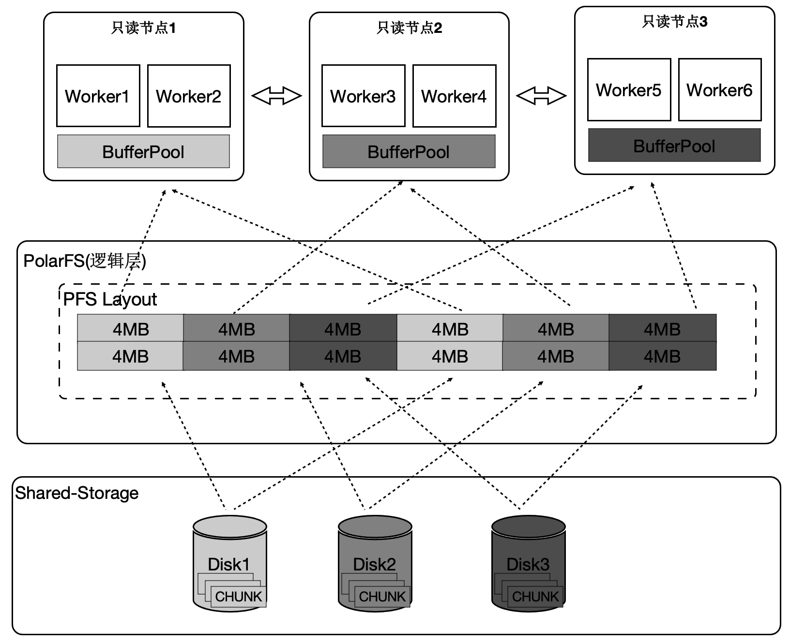
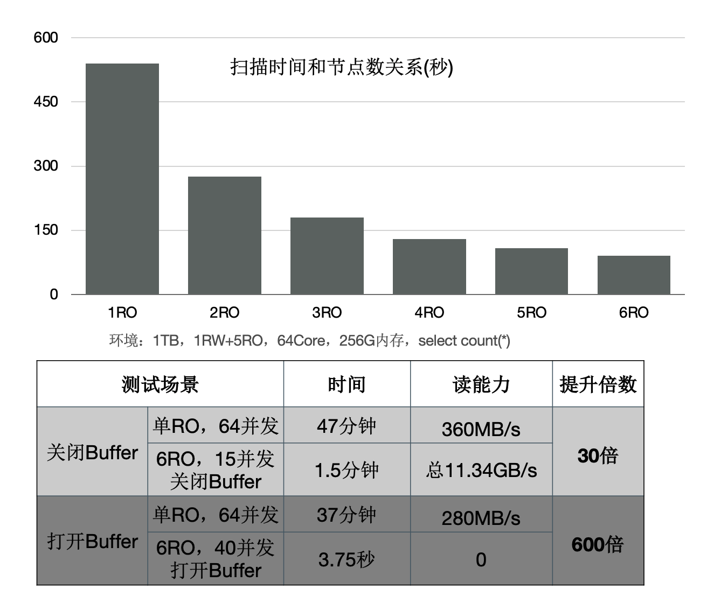
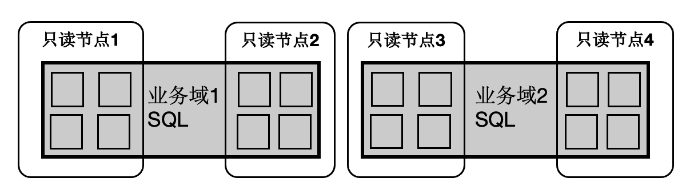

# HTAP架构

PolaDB读写分离后，由于底层是存储池，理论上IO吞吐是无限大的。而大查询只能在单个计算节点上执行，单个计算节点的CPU/MEM/IO是有限的，因此单个计算节点无法发挥出存储侧的大IO带宽的优势，也无法通过增加计算资源来加速大的查询。我们研发了基于Shared-Storage的MPP分布式并行执行，来加速在OLTP场景下OLAP查询。

PolarDB支持一套OLTP场景型的数据在如下两种计算引擎下使用：

- 单机执行引擎：处理高并发的OLTP型负载。
- 分布式执行引擎：处理大查询的OLAP型负载。

在使用相同的硬件资源时性能达到了传统Greenplum的90%，同时具备了SQL级别的弹性：在计算能力不足时，可随时增加参与OLAP分析查询的CPU，而数据无需重分布。

## HTAP架构原理

PolarDB底层存储在不同节点上是共享的，因此不能直接像传统MPP一样去扫描表。我们在原来单机执行引擎上支持了MPP分布式并行执行，同时对Shared-Storage进行了优化。
基于Shared-Storage的MPP是业界首创，它的原理是：

1. Shuffle算子屏蔽数据分布。
1. ParallelScan算子屏蔽共享存储。

如图所示：

1. 表A和表B做join，并做聚合。
1. 共享存储中的表仍然是单个表，并没有做物理上的分区。
1. 重新设计4类扫描算子，使之在扫描共享存储上的表时能够分片扫描，形成virtual partition。

## 分布式优化器

基于社区的GPORCA优化器扩展了能感知共享存储特性的Transformation Rules。使得能够探索共享存储下特有的Plan空间，比如：对于一个表在PolarDB中既可以全量的扫描，也可以分区域扫描，这个是和传统MPP的本质区别。  
图中，上面灰色部分是PolarDB内核与GPORCA优化器的适配部分。  
下半部分是ORCA内核，灰色模块是我们在ORCA内核中对共享存储特性所做的扩展。  

## 算子并行化

PolarDB中有4类算子需要并行化，下面介绍一个具有代表性的Seqscan的算子的并行化。为了最大限度的利用存储的大IO带宽，在顺序扫描时，按照4MB为单位做逻辑切分，将IO尽量打散到不同的盘上，达到所有的盘同时提供读服务的效果。这样做还有一个优势，就是每个只读节点只扫描部分表文件，那么最终能缓存的表大小是所有只读节点的BufferPool总和。

下面的图表中：

1. 增加只读节点，扫描性能线性提升30倍。
1. 打开Buffer时，扫描从37分钟降到3.75秒。

## 消除数据倾斜问题

倾斜是传统MPP固有的问题：

1. 在PolarDB中，大对象的是通过heap表关联TOAST​表，无论对哪个表切分都无法达到均衡。
1. 另外，不同只读节点的事务、buffer、网络、IO负载抖动。

以上两点会导致分布执行时存在长尾进程。  

1. 协调节点内部分成DataThread和ControlThread。
1. DataThread负责收集汇总元组。
1. ControlThread负责控制每个扫描算子的扫描进度。
1. 扫描快的工作进程能多扫描逻辑的数据切片。
1. 过程中需要考虑Buffer的亲和性。

需要注意的是：尽管是动态分配，尽量维护buffer的亲和性；另外，每个算子的上下文存储在worker的私有内存中，Coordinator不存储具体表的信息；  

下面表格中，当出现大对象时，静态切分出现数据倾斜，而动态扫描仍然能够线性提升。  

## SQL级别弹性扩展

那我们利用数据共享的特点，还可以支持云原生下极致弹性的要求：把Coordinator全链路上各个模块所需要的外部依赖存在共享存储上，同时worker全链路上需要的运行时参数通过控制链路从Coordinator同步过来，使Coordinator和worker无状态化。  

因此：

1. SQL连接的任意只读节点都可以成为Coordinator节点，这解决了Coordinator单点问题。
2. 一个SQL能在任意节点上启动任意worker数目，达到算力能SQL级别弹性扩展，也允许业务有更多的调度策略：不同业务域同时跑在不同的节点集合上。
   

## 事务一致性

多个计算节点数据一致性通过等待回放和globalsnapshot机制来完成。等待回放保证所有worker能看到所需要的数据版本，而globalsnapshot保证了选出一个统一的版本。

## TPCH性能 - 加速比

我们使用1TB的TPCH进行了测试，首先对比了PolarDB新的分布式并行和单机并行的性能：有3个SQL提速60倍，19个SQL提速10倍以上；  

另外，使用分布式执行引擎测，试增加CPU时的性能，可以看到，从16核和128核时性能线性提升；
单看22条SQL，通过该增加CPU，每个条SQL性能线性提升。

## TPCH性能 - 和Greenplum的对比

和传统MPP的Greenplum的对比，同样使用16个节点，PolarDB的性能是Greenplum的90%。

前面讲到我们给PolarDB的分布式引擎做到了弹性扩展，数据不需要充分重分布，当dop=8时，性能是Greenplum的5.6倍。

## 分布式执行加速索引创建

OLTP业务中会建大量的索引，经分析建索引过程中：80%是在排序和构建索引页，20%在写索引页。通过使用分布式并行来加速排序过程，同时流水化批量写入。

上述优化能够使得创建索引有4~5倍的提升。

## 分布式并行执行加速多模 - 时空数据库

PolarDB是对多模数据库，支持时空数据。时空数据库是计算密集型和IO密集型，可以借助分布式执行来加速。我们针对共享存储开发了扫描共享RTREE索引的功能。

- 数据量：40000万，500 GB
- 规格：5个只读节点，每个节点规格为16 核CPU、128 GB 内存
- 性能：
  - 随CPU数目线性提升
  - 共80核CPU时，提升**71倍**

