# HTAP能力

## 功能简介

PolaDB存储计算分离架构提供了数据存储共享+计算读写分离能力。在实际场景中，PolarDB的很多客户有这样的TP/AP共用的需求：他们白天使用PolarDB处理高并发的TP的请求，晚上TP流量下降机器空闲后，继续用PolarDB进行AP的报表分析。但是这样仍然没有最大化利用客户的空闲机器资源，原因在于原生的PolarDB for PostgreSQL系统在处理AP查询时会遇到两个挑战：

- 存储计算分离后的PolarDB支持多个计算节点，单个SQL在原生PostgreSQL执行引擎下只能在单个节点上执行，无法利用其它节点的计算资源CPU和内存。
- PolarDB的底层是存储池，理论上IO吞吐是无限大的，而单个SQL在原生PostgreSQL执行引擎下只能在单个节点上执行，单个计算节点的CPU和内存是有限的，无法充分发挥存储侧的大IO带宽的优势。

为了解决客户实际使用中的痛点，PolarDB需要实现HTAP。

传统数据库关于HTAP的解决方案，从TP/AP系统共享还是分离的角度看，主要有三种：

- TP和AP在存储/计算上都分离。
- TP和AP在存储/计算上都共享。
- TP和AP在存储上共享，在计算上分离。

第一种方案，TP和AP在存储/计算上都分离，可以做到TP、AP的完全隔离，互不影响，但是存在以下问题：

- TP数据导入到AP系统，有延迟，时效性不高。
- 增加冗余AP存储，成本增加。
- 增加AP系统，运维难度增加。

第二种方案，TP和AP在存储和计算资源都共享，这样可以做到成本最小化，资源利用最大化。但是仍然存在以下问题：

- 由于计算共享，AP查询、TP查询同时运行时，或多或少存在相互影响。
- 当AP查询比重增大时，系统需要扩计算节点，存储也因此需要重分布，导致无法快速弹性扩展。

PolarDB存储计算分离架构天然支持第三种方案，即TP/AP存储共享、计算分离。在此基础上，我们研发了基于共享存储的分布式执行引擎，提供了跨机并行执行、弹性计算、弹性扩展的保障，使得PolarDB初步具备了HTAP的能力。

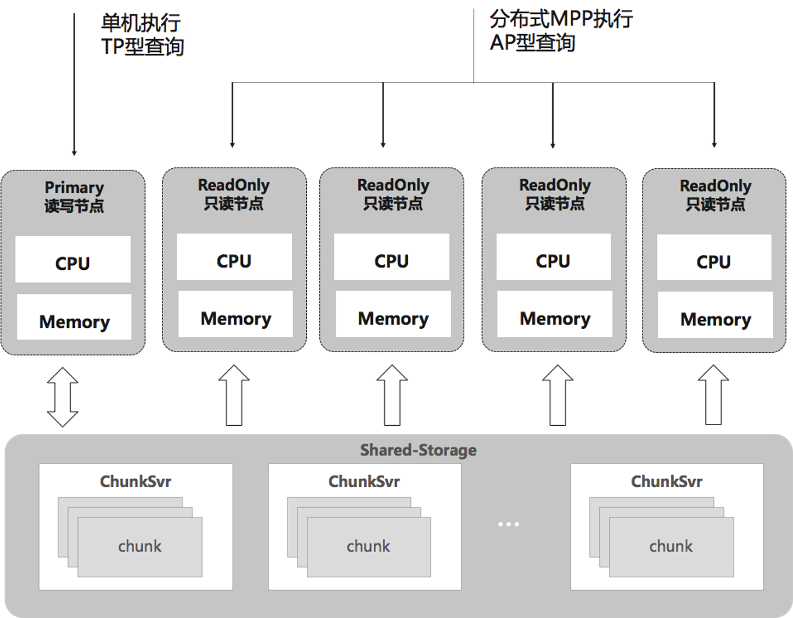

PolarDB的HTAP架构具有以下特点：

- 一体化存储，在降低成本的同时，能提供毫秒级数据新鲜度和快速扩容计算节点的保障。
- TP/AP的物理隔离，解耦了TP/AP的计算环境，杜绝CPU/MEM相互影响。

- Serverless弹性扩展，支持在任何一个计算节点发起MPP查询，支持ScaleUp、ScaleOut弹性调整计算资源。
- 消除数据倾斜、计算倾斜，实现了能者多劳的调度。

## 设计原理

PolarDB底层存储数据在不同节点上是共享的，因此不能直接像传统Share-Nothing的MPP一样去扫描表。因此我们基于Shared-Storage研发了MPP分布式执行引擎，其主要原理是：

- 使用分布式优化器PX Optimizer产生分布式执行计划，支持全部Parallel Query、DML算子。
- 新增的Shuffle算子屏蔽数据分布，定制Parallel Scan屏蔽共享存储，从而适配共享存储的MPP扫描。

- 设计Serverless弹性机制，实现MPP任意调度和弹性扩展的突破。
- 设计实现自适应扫描机制，解决MPP数据、计算倾斜问题。

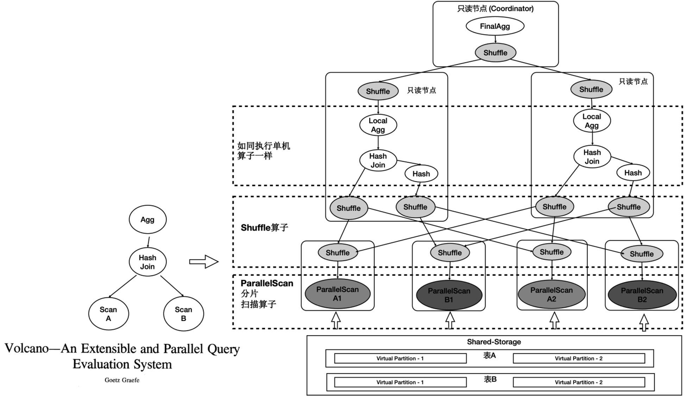

如上图所示：

1. 表A和表B做join，并做聚合。
2. 共享存储中的表仍然是单个表，并没有做物理上的分区。
1. 重新设计4类扫描算子，使之在扫描共享存储上的表时能够分片扫描，形成virtual partition。

### 分布式优化器

基于社区的ORCA优化器，我们研发了适配共享存储的PX Optimier优化器，同时具备了弹性扩展属性。如下图，上面灰色部分是PolarDB内核与ORCA优化器的适配部分，下面是ORCA内核，其中灰色模块是PolarDB在ORCA内核中对共享存储特性所做的扩展。

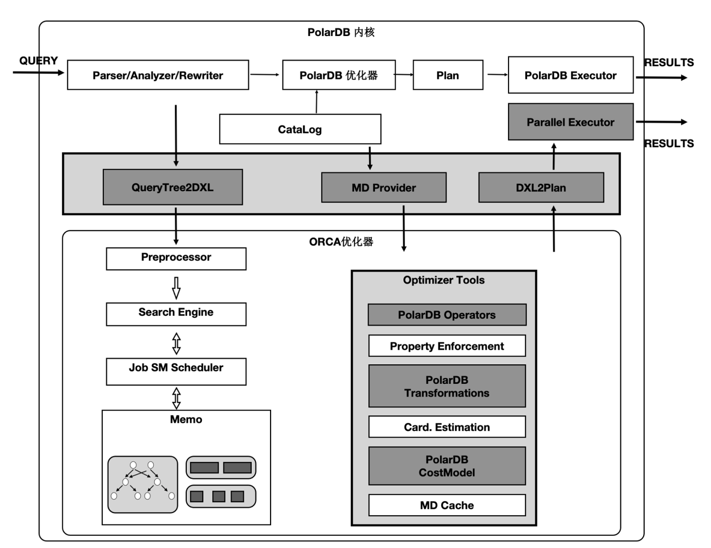

PX Optimier优化器的核心改动包括：

- 扩展感知共享存储特性的Transformation Rules，使得能够探索共享存储下特有的Plan空间，对于一个表既可以全量的扫描，也可以分区域扫描。
- 扩展对完整分区表功能的支持，如Hash分区、多级分区、Partition Wise Join等。
- 新增匹配共享存储模式代价模型。

### 分布式执行引擎

PolarDB分布式执行器完整支持基础算子（Scan、Join、Aggregate、Sort、Union、CTE等）的并行化，同时还扩展支持Shuffle算子，通过Gather、Broadcast、Hash三种Shuffle方式实现数据的分化和聚合处理。以具有代表性的Seqscan的算子的并行化。为了最大限度的利用存储的大IO带宽，在顺序扫描时，按照4MB为单位做逻辑切分，将IO尽量打散到不同的盘上，达到所有的盘同时提供读服务的效果。这样做还有一个优势，就是每个只读节点只扫描部分表文件，那么最终能缓存的表大小是所有只读节点的BufferPool总和。

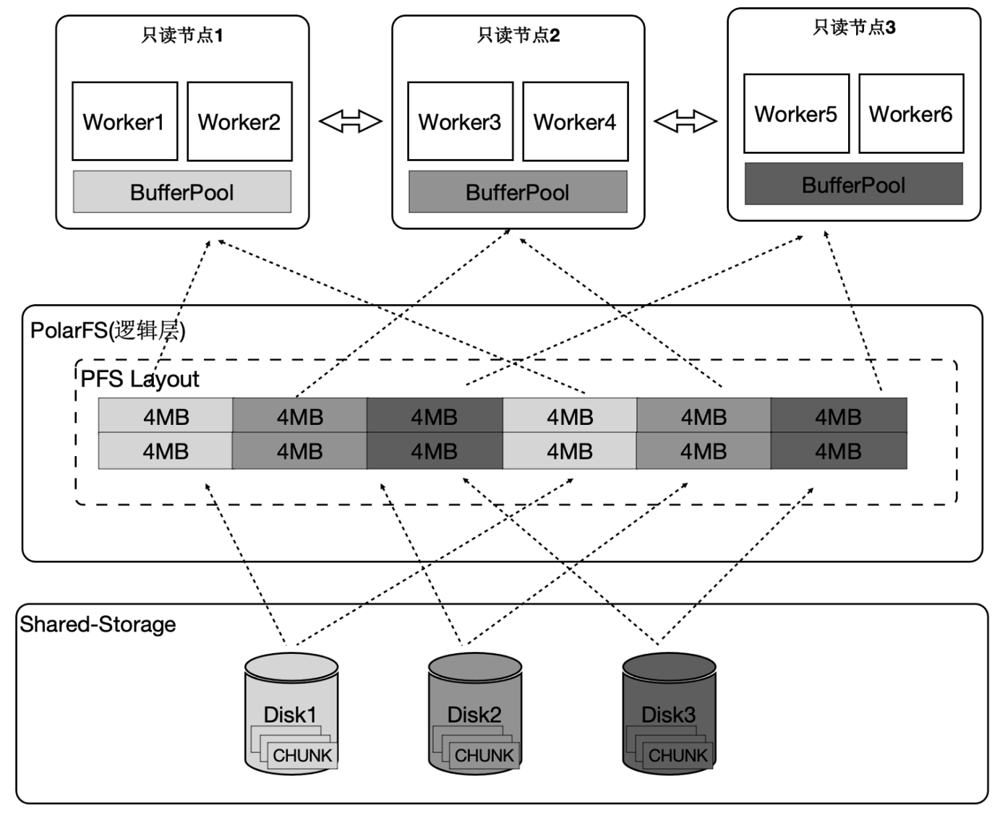

下面的图表中：
1. 增加只读节点，扫描性能线性提升30倍。
2. 打开Buffer时，扫描从37分钟降到3.75秒。

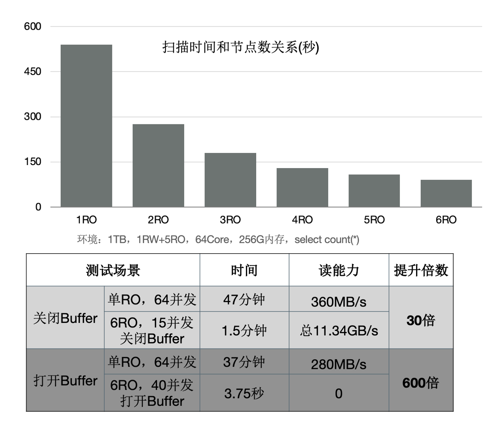

### Serverless弹性扩展

传统基于PostgresSQL的MPP通常会受限只能但单个节点发起MPP查询，每个节点上只能单个进程扫描一张表。为了支持云原生下Serverless弹性扩展的要求，我们引入事务一致性，如下图所示就是分布式事务一致性保障的流程。我们任意选择一个节点作为Coordinator节点后，Coordinator的ReadLSN会作为约定LSN，所有MPP节点的快照版本号中最小的版本号作为约定全局快照版本号，通过LSN等待回放和GlobalSnapshot同步机制，确保在任何一个节点发起MPP查询数据和快照均达到一致可用的状态。

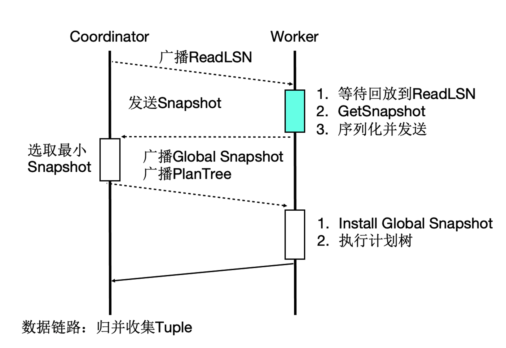

要达到Serverless弹性扩展，我们还基于共享存储的特点，将Coordinator节点全链路上各个模块所需要的外部依赖都存在共享存储上，各Worker节点全链路上需要的运行时参数通过控制链路从Coordinator节点同步过来，从而使Coordinator节点和Worker节点全链路无状态化。如下图所示，表数据和元数据是所有MPP节点共享的，MPP运行时参数都统一使用Coordinator节点的。

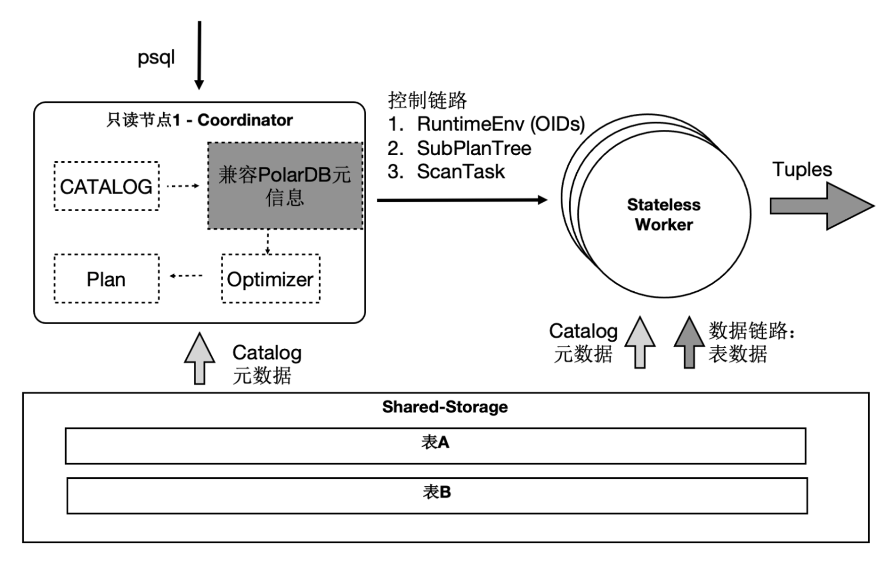

这样一来，SQL连接的任意只读节点都可以成为QC节点，这解决了Coordinator单点问题。一个SQL能在任意节点上，启动任意Worker数目，能达到SQL级别弹性扩展，也允许业务有更多的调度策略：不同业务域同时跑在不同的节点集合上。 

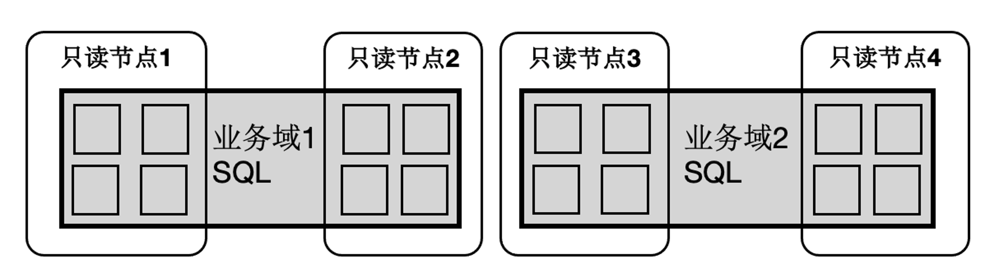

### 消除倾斜

数据倾斜、计算倾斜是传统MPP固有的问题：
- 数据打散不均衡导致, 在PostgreSQL中还会由于大对象TOAST表存储引入不可避免的数据分布不均衡。
- 不同只读节点的事务、Buffer、网络、IO负载抖动，也会导致计算速度不均衡。

PolarDB设计实现了自适应扫描机制， 采用QC节点协调、PX节点询问的工作模式，在执行数据扫描时，QC节点内存中创建一个任务管理器，根据扫描任务对PX worker节点进行调度：
- QC节点内部分成DataThread和ControlThread。
- DataThread负责收集汇总元组。
- ControlThread负责控制每个扫描算子的扫描进度，扫描快的worker能多扫描逻辑的数据切片。
- 同时还要考虑Buffer的亲和性，保证每个PX worker尽量扫描固定的逻辑分片数据。

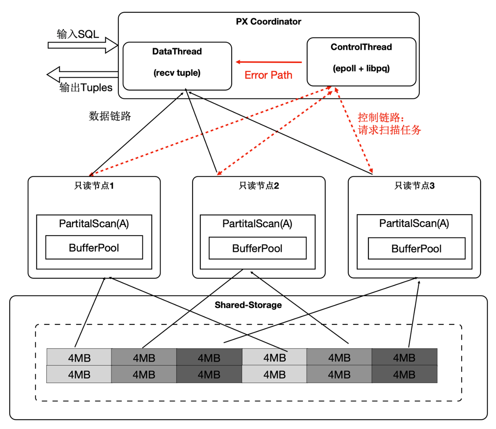

下面表格中，当出现大对象时，静态切分出现数据倾斜，而动态扫描仍然能够线性提升。

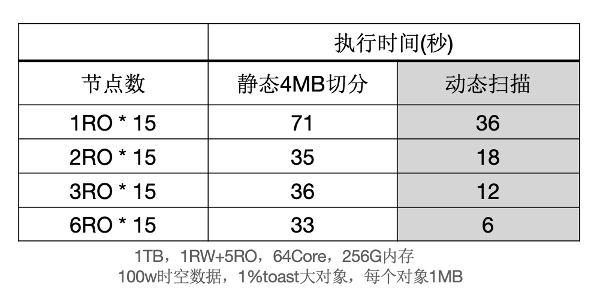

## 功能特性

PolarDB分布式执行引擎经过持续迭代的演进，目前已经支持如下完整支持Parallel Query、Parallel DML和分区表特性，并且已经在云上开放使用。

### Parallel Query

PolarDB PX Optimizer是基于社区ORCA优化器的二次开发，目前除了完整支持ORCA支持的Parallel Query外， 还是支持以下特性：
- 支持MPP节点的任意搭配
- 支持全局维度、表维度的MPP并行/并行度控制
- 支持SeqScan、IndexScan的全量扫描方式
- 支持HASH分区的分区表查询
- 支持HASH分区的分区表裁剪
- 支持分区表的多级分区
- 支持分区表的Partition Wise Join
- 支持LeftIndexNestloopJoin

我们使用1TB的TPCH进行了测试，首先对比了PolarDB新的分布式并行和单机并行的性能：有3个SQL提速60倍，19个SQL提速10倍以上。

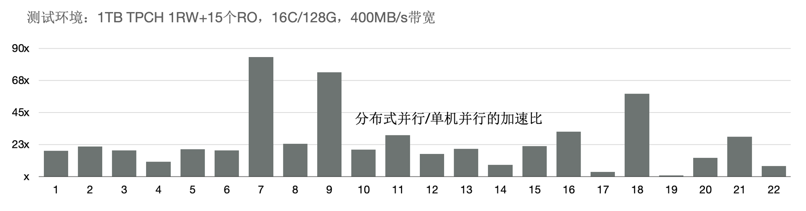

另外，使用分布式执行引擎测试增加CPU时的性能，可以看到，从16核和128核时性能线性提升；单看22条SQL，通过该增加CPU，每条SQL性能线性提升。

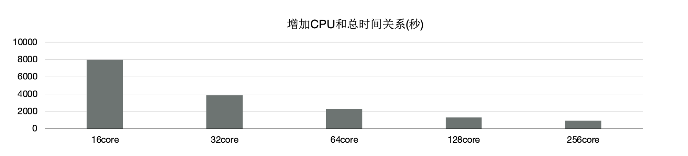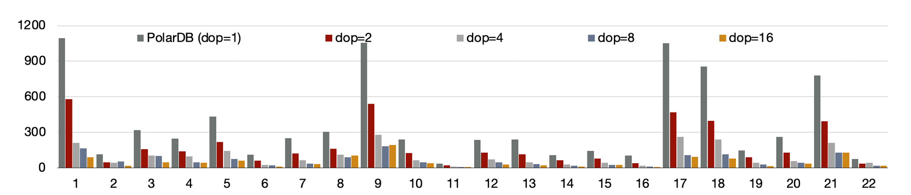

### Parallel DML

PolarDB同样扩展支持完整的Parallel DML，具备以下特性：
- 支持非分区表DML（Insert、Update、Delete）的一写多读
- 支持非分区表DML（Insert、Update、Delete）的多写多读
- 支持分区表DML（Insert）的一写多读
- 支持分区表DML（Insert）的多写多读

### 索引创建加速

OLTP业务中会创建大量的索引，其中80%是在排序和构建索引页，20%在写索引页。通过使用PolarDB分布式执行引擎可以加速排序过程，同时流水化构建索引页，批量写入索引页。 当前支持的索引创建加速特性包括：
- Create Btree Index加速
- Create Btree Index Concurrently加速

上述优化能够使得创建索引有4~5倍的提升。

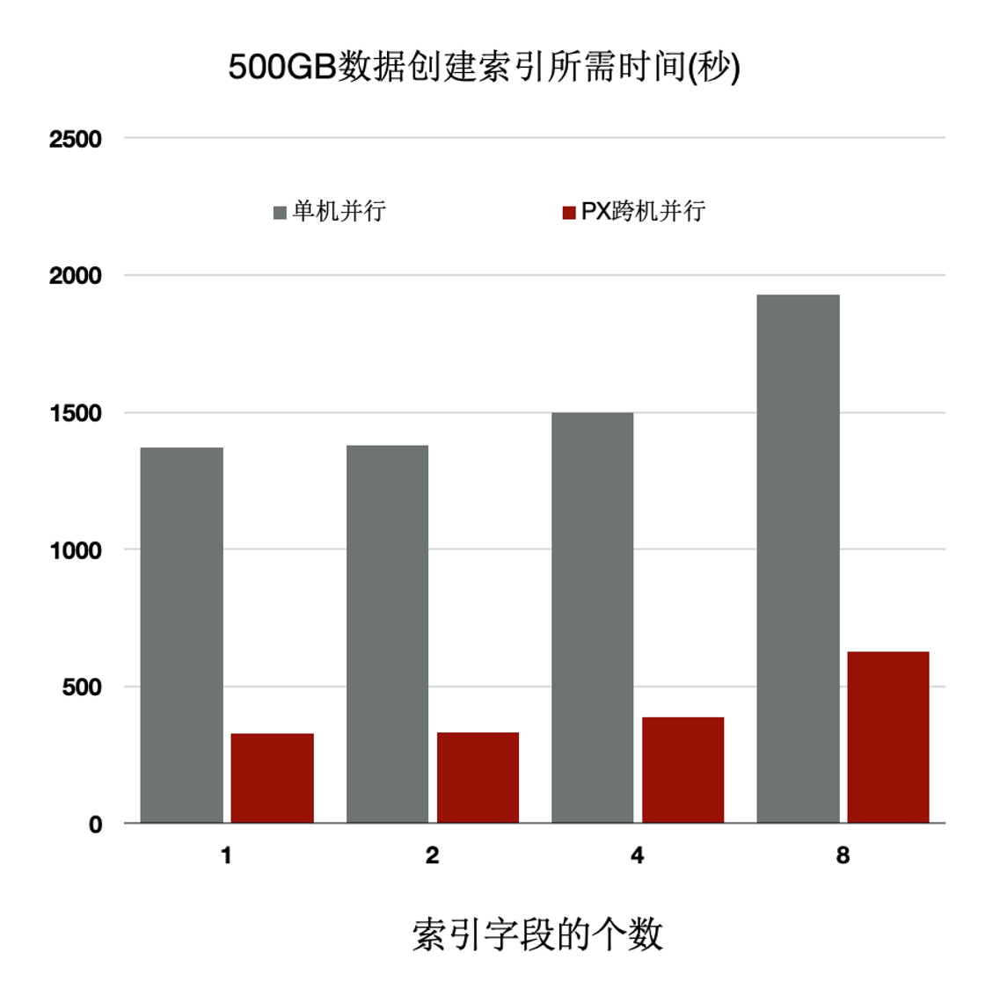

