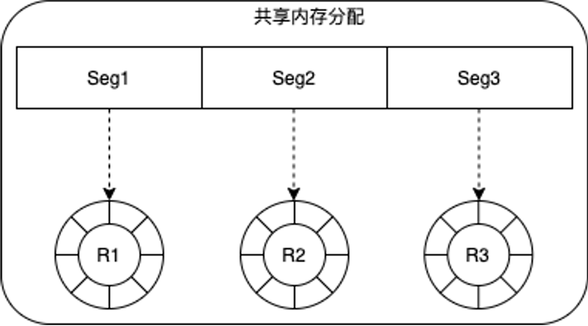
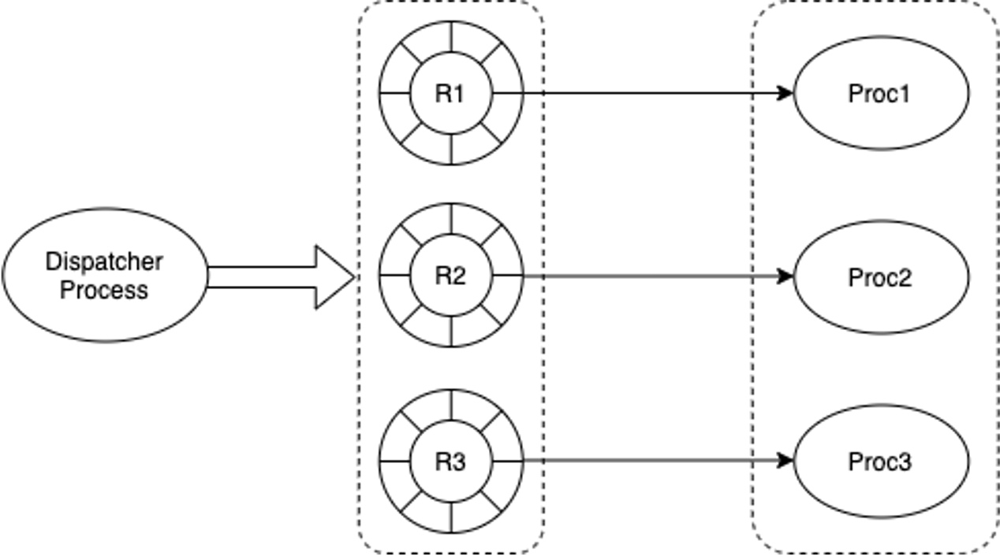
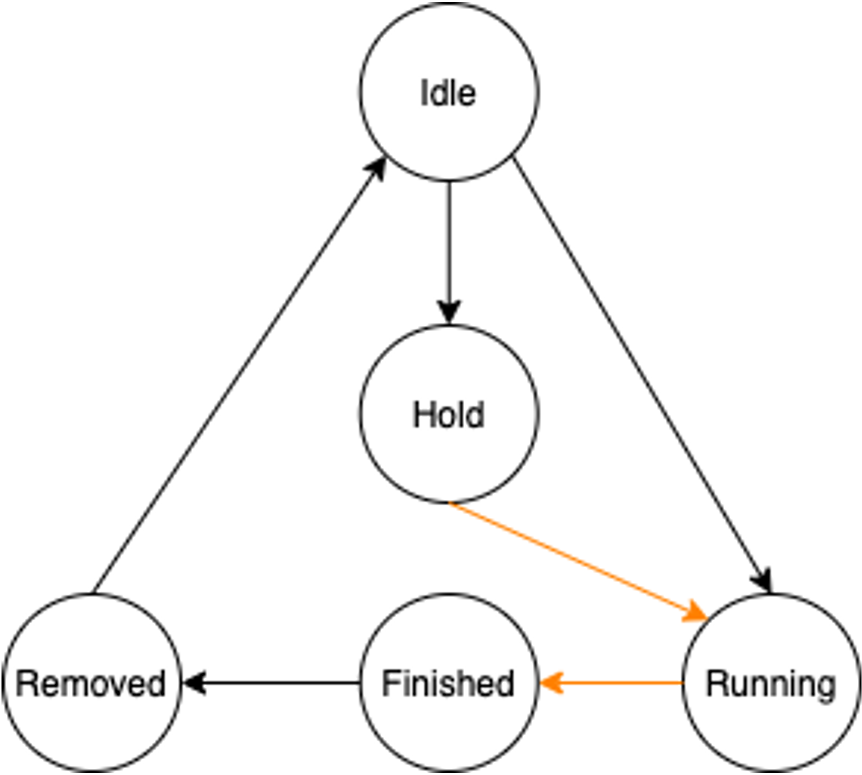
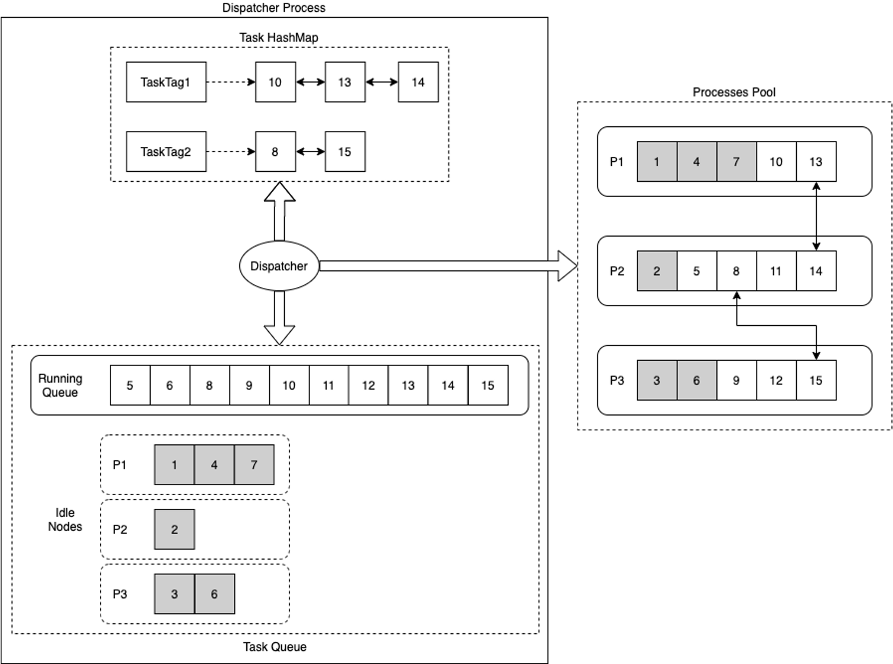
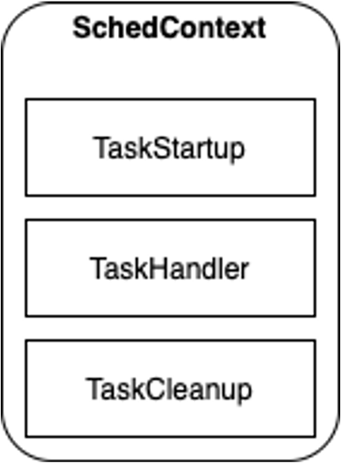
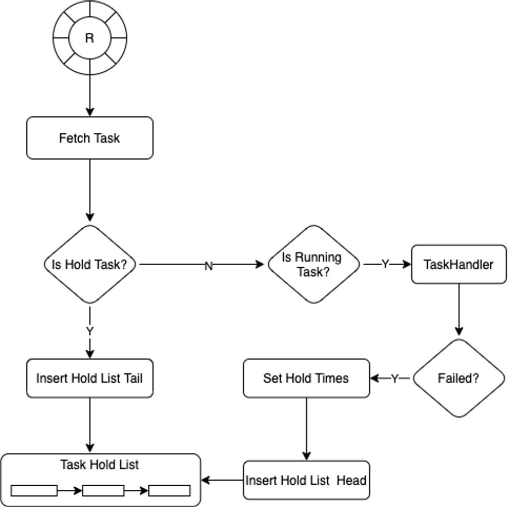
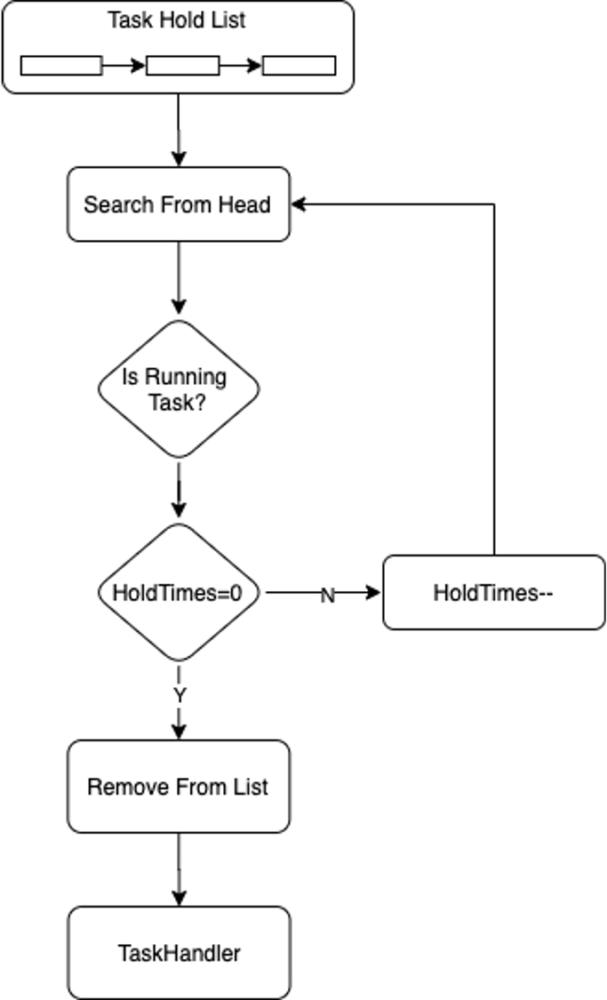
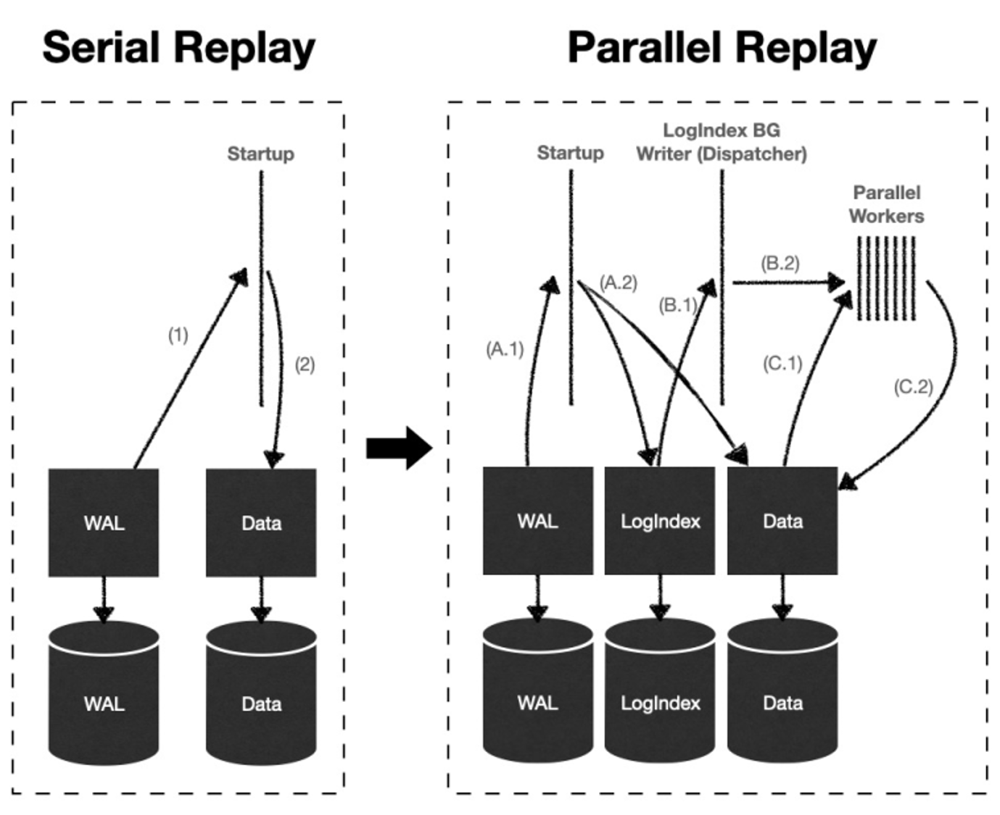
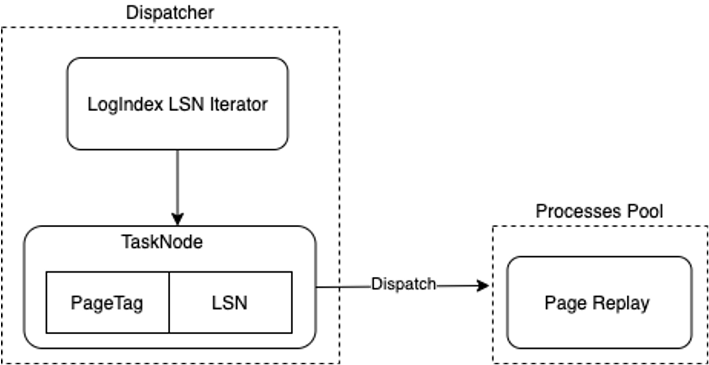

# 并行回放

## 功能简介

一写多读架构下，只读节点Replica运行过程中，LogIndex BGW背景回放进程和Backend进程分别利用LogIndex数据在不同的Buffer上回放WAL日志，本质上是达到了一种并行回放WAL日志的效果。

鉴于WAL日志回放在PolarDB集群高可用中起到至关重要的作用，将并行回放WAL日志的思想用到常规的日志回放路径上，是一种很好的优化思路。并行回放WAL日志至少可以在以下三个场景下发挥优势：主库节点、只读节点Replica以及Standby节点的Crash Recovery过程，只读节点Replica的LogIndex BGW进程的持续回放WAL日志过程，Standby节点Startup进程持续回放WAL日志过程。

## 实现原理

### 原理概述

一个WAL日志可能修改多个数据块Block。假设第i个WAL日志LSN是LSN<sub>i</sub>，第i个WAL日志修改的数据块列表为Block<sub>i</sub> = {Block<sub>i,0</sub>, Block<sub>i,1</sub>, ..., Block<sub>i,m</sub>}。如果定义最小的回放子任务为Task={LSN<sub>i</sub> -> Block<sub>i,j</sub>}，表示在数据块Block<sub>i,j</sub>上回放第i个WAL日志，那么一个WAL日志就可以表示成多个回放子任务，多个WAL日志就可以表示成一系列回放子任务的集合TASK={Task<sub>1</sub>, Task<sub>2</sub>, ..., Task<sub>n</sub>}。

在日志回放子任务集合TASK中，每个子任务的执行，有时候并不依赖于前序子任务的执行结果，因此，很多子任务可以并行执行，而且不会影响最终的回放结果。PolarDB借助这种思想，提出了一种并行任务执行框架，并成功运用到了WAL日志回放过程中。

### 并行任务执行框架



- 将一段共享内存根据并发进程的数目进行等分，每一段组成一个环形队列，分配给一个进程。
- 通过配置参数设定每个环形队列的深度。



- Dispatcher进程
  - 通过将任务分发给指定的进程来控制并发调度。
  - 负责将进程执行完的任务从队列中删除。

- 进程组
  - 进程组中的每一个进程从相应的环形队列中获取需要执行的任务，根据任务的状态决定是否执行。


#### 任务

环形队列的内容由TaskNode组成，每个TaskNode包含五个状态Idle、Running、Hold、Finished、Removed。



- Idle：表示该Task Node未分配任务。
- Running：表示该Task Node已经分配任务，正在等待进程执行，或已经在执行。

- Hold：表示该Task Node有前向依赖的任务，需要等待依赖的任务执行完再执行。
- Finished：表示进程组中的进程已经执行完该任务。

- Removed：Dispatcher进程发现一个任务的状态已经是Finished，那么该任务所有的前置依赖任务也都应该状态为Finished，Removed状态表示Dispatcher已经将该任务以及该任务的所有前置任务都从Dispatcher的管理结构体中删除；可以通过该机制保证Dispatcher按顺序处理有依赖关系的任务执行结果。

上述状态机的变迁过程中，黑色线标识的状态变迁在Dispatcher进程中完成，橙色线标识的状态变迁在并行进程组中完成。

#### Dispatcher进程

Dispatcher进程有三个关键数据结构Task HashMap、Task Running Queue以及Task Idle Nodes。

- Task HashMap负责记录TaskTag和相应的执行任务列表的hash映射关系。
  - 每个任务有一个指定的TaskTag，如果两个任务间存在依赖关系，则它们的TaskTag相同。
  - 在分发任务时，如果一个TaskNode存在前置依赖任务，则状态标识为Hold，需等待前置任务先执行。

- Task Running Queue负责记录当前正在执行的任务。
- Task Idel Nodes负责记录进程组中不同进程，当前处于Idle状态的Task Node。

Dispatcher调度策略如下：

- 要执行的Task Node有相同Task Tag的任务在执行，则优先将该Task Node分配到该Task Tag链表最后一个Task Node所在的执行进程（目的是有依赖关系的任务尽量在同一个进程执行，减少进程间的交互）。
- 如果期望优先分配的进程队列满，或者没有相同的Task Tag在执行，则按进程组顺序枚举一个进程，从中获取Idle Task Node，分配任务进行执行（目的是让任务尽量平均分配到不同的进程进行执行）。



#### 进程组



该并行执行针对的是相同类型的任务，它们具有相同的Task Node数据结构。在进程组初始化时配置SchedContext，指定负责执行具体任务的函数指针。

- TaskStartup表示进程执行任务前需要进行的初始化动作
- TaskHandler根据传入的TaskNode，负责执行具体的任务

- TaskCleanup表示执行进程退出前需要执行的回收动作



进程组中的进程从环形队列中获取一个TaskNode，如果该TaskNode当前的状态是Hold，则将该Node插入到HoldList的尾部；如果TaskNode的状态为Running，则调用TaskHandler执行；如果TaskHandler执行失败，则设置该TaskNode重新执行需要等待调用的次数，默认为3，将该TaskNode插入到Hold List的头部。



进程优先从Hold List头部搜索，获取可执行的Task；如果Task状态为Running，且等待调用次数为0，则执行该Task；如果Task状态为Running，但等待调用次数大于0，则将等待调用次数减去1。

### WAL日志并行回放

根据LogIndex章节介绍，LogIndex数据中记录了WAL日志和其修改的数据块之间的对应关系，而且LogIndex数据支持使用LSN进行检索。鉴于此，PolarDB数据库在Standby节点持续回放WAL日志过程中，引入了上述并行任务执行框架，并结合LogIndex数据将WAL日志的回放任务并行化，提高了Standby节点数据同步的速度。

#### 工作流程



- Startup进程：解析WAL日志后，仅构建LogIndex数据而不真正回放WAL日志。
- LogIndex BGW背景回放进程：成为上述并行任务执行框架的Dispatcher进程，利用LSN来检索LogIndex数据，构建日志回放的子任务，并分配给并行回放进程组。

- 并行回放进程组内的进程：执行日志回放子任务，对数据块执行单个日志的回放操作。
- Backend进程：主动读取数据块时，根据PageTag来检索LogIndex数据，获得修改该数据块的LSN日志链表，对数据块执行完整日志链的回放操作。

#### 日志回放子任务



- Dispatcher进程利用LSN来检索LogIndex数据，按LogIndex插入顺序枚举PageTag和对应LSN，构建{LSN -> PageTag}，组成相应的TaskNode。
- PageTag作为TaskNode的Task Tag。

- 将枚举组成的TaskNode分发给Processes Pool中的进程进行回放。

## 使用方法

要开启并行回放功能，请在Standby节点的postgresql.conf中添加以下参数：

```
polar_enable_parallel_replay_standby_mode=on
```

