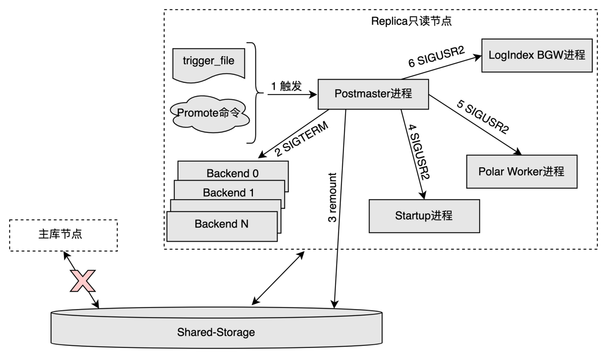
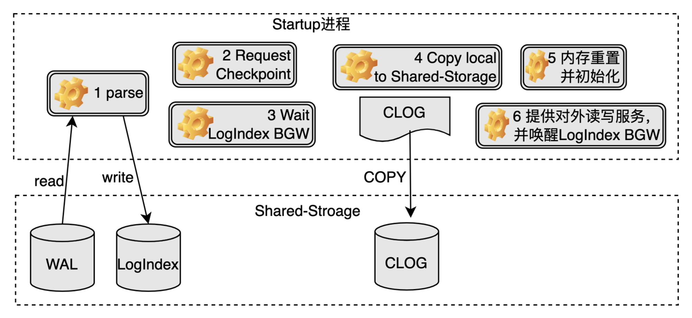
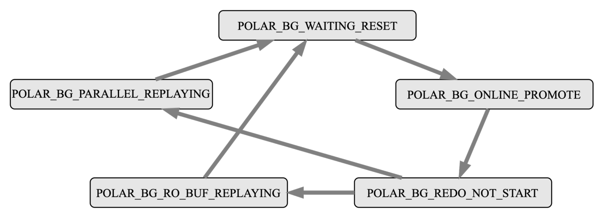

# RO OnlinePromote

## 功能简介

PolarDB是基于共享存储的一写多读架构，与传统数据库的主备架构有所不同。Standby节点是传统数据库的备库节点，有独立的存储，与主库节点之间通过传输完整的WAL日志来同步数据。只读节点（也称为Replica节点）是PolarDB数据库的备库节点，与主节点共享同一份存储，与主库节点之间通过传输[WAL Meta日志信息](LogIndex.md#wal-meta)来同步数据。

传统数据库支持Standby节点升级为主库节点的Promote操作，在不重启的情况下，提升备库节点为主库节点，继续提供读写服务，保证集群高可用的同时，也有效降低了实例的恢复时间RTO。PolarDB同样需要备库节点提升为主库节点的Promote能力，鉴于只读节点与传统数据库Standby节点的不同，PolarDB提出一种一写多读架构下只读节点的OnlinePromote机制。

## 实现原理

### 触发机制

PolarDB使用和传统数据库一致的备库节点Promote方法，触发条件如下：

- 调用pg_ctl工具的Promote命令，pg_ctl工具会向Postmaster进程发送信号，接收到信号的Postmaster进程再通知其他进程执行相应的操作，完成整个Promote操作。
- 在recovery.conf中定义trigger file的路径，其他组件通过生成trigger_file来触发。

相比于传统数据库Standby节点的Promote操作，PolarDB的Replica节点OnlinePromote操作需要多考虑以下几个问题：

- Replica节点OnlinePromote为主库节点后，需要以读写模式进行重新挂载共享存储。
- Replica节点会在内存中维护一些重要的控制信息，这些控制信息在主库节点上会被持久化到共享存储中，Promote过程中这部分信息也需要持久化到共享存储。

- Replica节点在内存中通过日志回放得到的数据信息，OnlinePromote过程中需要确认哪些数据可以写入共享存储。
- Replica节点在内存中回放WAL日志时，缓冲区淘汰方法和不刷脏的特性与主库节点截然不同，OnlinePromote过程中该如何处理。

- Replica节点OnlinePromote过程中，各个子进程的处理过程。

### Postmaster进程处理过程

- Postmaster进程发现trigger_file文件或者接收到OnlinePromote命令后，进入OnlinePromote的处理流程。

- Postmaster进程发送SIGTERM信号给当前所有Backend进程。

  > 只读节点在OnlinePromote过程中可以继续提供只读服务，但是只读的数据不能保证是最新的，为了避免切换过程中从新的主库节点读到旧的数据，这里先将所有的Backend会话断开，在Startup进程退出后开始对外提供读写服务。

- Postmaster进程重新以读写模式挂载共享存储，需要底层存储提供相应的功能支持。

- Postmaster进程发送SIGUSR2信号给Startup进程，通知其结束回放并处理OnlinePromote操作。

- Postmaster进程发送SIGUSR2信号给Polar Worker辅助进程，通知其停止对于部分LogIndex数据的解析，由于其解析的这部分LogIndex数据只对于正常运行期间的Replica节点有用途。

- Postmaster进程发送SIGUSR2信号给LogIndex BGW背景回放进程（LogIndex Backgroup Worker Process），通知其处理OnlinePromote操作。

### Startup进程处理过程

- Startup进程回放完所有的旧主库节点产生的WAL日志，生成相应的LogIndex数据。
- Startup进程确认旧主库节点最后一次的Checkpoint在Replica节点也完成，目的是确保对应的Checkpoint应该在Replica节点本地写入的数据都落盘。

- Startup进程等待确认LogIndex BGW进程进入POLAR_BG_WAITING_RESET状态。
- Startup进程将clog等在Replica节点本地的数据拷贝到共享存储中。

- Startup进程重置WAL Meta Queue内存空间、从共享存储中重新加载slot信息，并重新设置LogIndex BGW进程的回放位点为其与当前一致性位点两者的最小值，表示接下来LogIndex BGW进程从该位点开始新的回放。
- Startup进程将节点角色设置为主库节点，并设置LogIndex BGW进程的状态为POLAR_BG_ONLINE_PROMOTE，至此实例可以对外提供读写服务。

### LogIndex BGW进程处理过程

LogIndex BGW进程有自己的状态机，其在生命周期内，一直按照该状态机运行，具体每个状态机的操作内容如下：

- POLAR_BG_WAITING_RESET：LogIndex BGW进程状态重置，通知其他进程状态机发生变化。
- POLAR_BG_ONLINE_PROMOTE：读取LogIndex数据，组织并分发回放任务，利用并行回放进程组回放WAL日志，该状态的进程需要回放完所有的LogIndex数据才会进行状态切换，最后推进背景回放进程的回放位点。

- POLAR_BG_REDO_NOT_START：表示回放任务结束。
- POLAR_BG_RO_BUF_REPLAYING：Replica节点正常运行时，进程处于该状态，读取LogIndex数据，按照WAL日志的顺序回放一定量的WAL日志，每回放一轮，便会推进背景回放进程的回放位点。

- POLAR_BG_PARALLEL_REPLAYING：LogIndex BGW进程每次读区一定量的LogIndex数据，组织并分发回放任务，利用并行回放进程组回放WAL日志，每回放一轮，便会推进背景回放进程的回放位点。

LogIndex BGW进程受到Postmaster的SIGUSR2信号后，执行OnlinePromote操作的流程如下：

- 将所有的LogIndex数据落盘，并切换状态为POLAR_BG_WAITING_RESET。
- 等待Startup进程将其切换为POLAR_BG_ONLINE_PROMOTE状态。
  - 实例Replica执行OnlinePromote操作前，背景回放进程只回放在buffer pool中的页面；当Replica节点处于OnlinePromote过程中时，鉴于之前主库节点可能有部分页面在内存中，未来得及落盘，所以背景回放进程按照日志顺序回放所有的WAL日志，并在回放后调用MarkBufferDirty标记该页面为脏页，等待刷脏。
  - 回放结束后，推进背景回放进程的回放位点，然后切换状态为POLAR_BG_REDO_NOT_START。

### 刷脏控制

每个脏页都带有一个[Oldest LSN](Buffer-Management.md#flushlist)，该LSN在FlushList里是有序的，目的是通过该LSN来确定一致性位点。Replica节点OnlinePromote过程后，由于同时存在着回放和新的页面写入，如果像主库节点一样直接将当前的WAL日志插入位点设为Buffer的Oldest LSN，可能会导致比它小的Buffer还未落盘，但已经设置了新的一致性位点。所以Replica节点OnlinePromote过程中需要面对两个问题：

- 旧主库节点的WAL日志回放时如何给脏页设置Oldest LSN。
- 新主库节点产生的脏页如何设置Oldest LSN。

因此，PolarDB在Replica节点OnlinePromote过程中，将上述两类情况产生的脏页的Oldest LSN都设为LogIndex BGW进程推进的回放位点，只有标记为相同Oldest LSN的Buffer都落盘了，才将一致性位点向前推进。

## 使用方法

PolarDB使用的备库节点Promote方法，触发条件如下：

- 调用pg_ctl工具的Promote命令，pg_ctl工具会向Postmaster进程发送信号，接收到信号的Postmaster进程再通知其他进程执行相应的操作，完成整个Promote操作。
- 在recovery.conf中定义trigger file的路径，其他组件通过生成trigger_file来触发。
