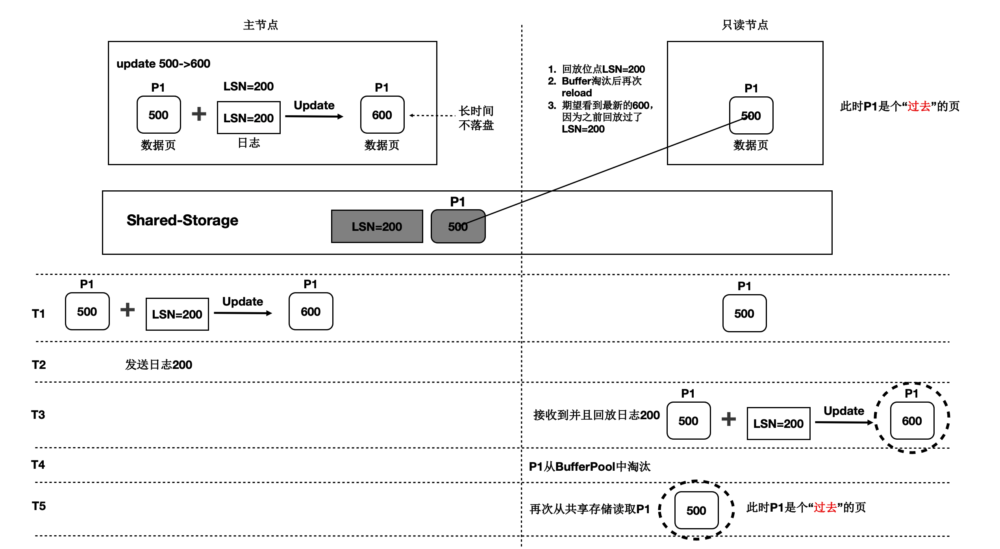
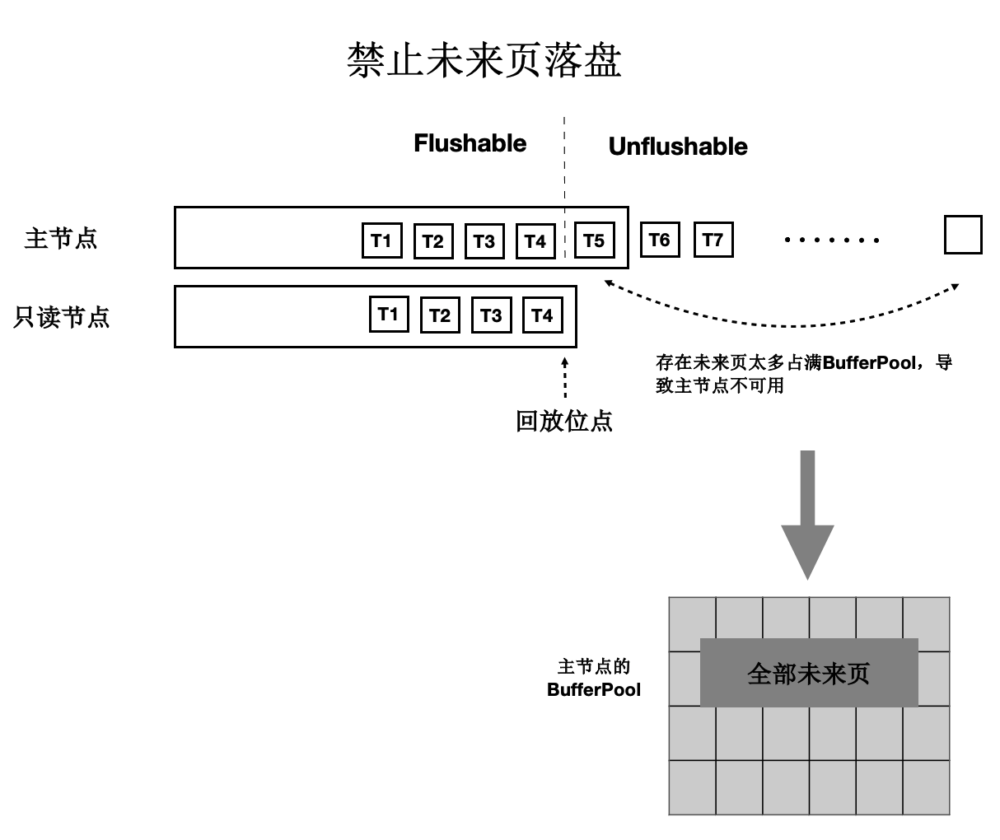
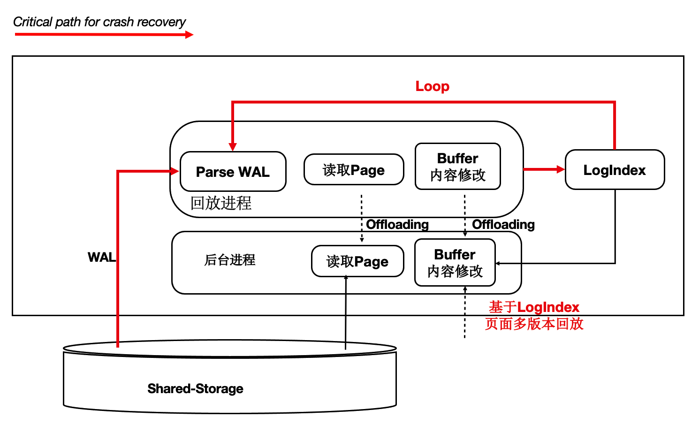
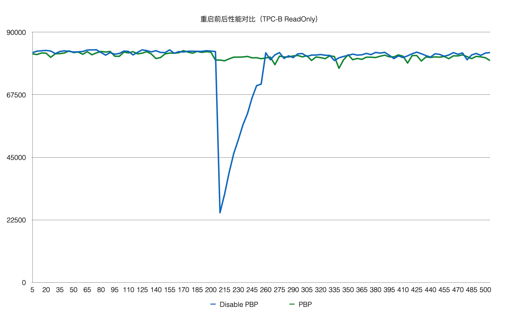

# 存储计算分离架构

PolarDB是存储计算分离的设计，存储集群和计算集群可以分别独立扩展：

1. 当计算能力不够时，可以单独扩展计算集群。
1. 当存储容量不够时，可以单独扩展存储集群。

## Shared-Storage带来的挑战

基于Shared-Storage之后，数据库由传统的share nothing，转变成了shared storage架构。需要解决如下问题：

- 数据一致性：由原来的N份计算+N份存储，转变成了N份计算+1份存储。
- 读写分离：如何基于新架构做到低延迟的复制。
- 高可用：如何Recovery和Failover。
- IO模型：如何从Buffer-IO向Direct-IO优化。

基于Shared-Storage后，主节点和多个只读节点共享一份存储数据，主节点刷脏不能再像传统的刷脏方式了，否则：

1. 只读节点去存储中读取的页面，可能是比较老的版本，不符合他自己的状态。
1. 只读节点指读取到的页面比自身内存中想要的数据要超前。
1. 主节点切换到只读节点时，只读节点接管数据更新时，存储中的页面可能是旧的，需要读取日志重新对脏页的恢复。

对于第一个问题，我们需要有页面多版本能力；对于第二个问题，我们需要主库控制脏页的刷脏速度。

## 架构原理

首先来看下基于Shared-Storage的PolarDB的架构原理。

- 主节点为可读可写节点（RW），只读节点为只读（RO）。
- Shared-Storage层，只有主节点能写入，因此主节点和只读节点能看到一致的落盘的数据。
- 只读节点的内存状态是通过回放WAL保持和主节点同步的。
- 主节点的WAL日志写到Shared-Storage，仅复制WAL的meta给只读节点。
- 只读节点从Shared-Storage上读取WAL并回放。

## 数据一致性

### 传统数据库的内存状态同步

传统share nothing的数据库，主节点和只读节点都有自己的内存和存储，只需要从主节点复制WAL日志到只读节点，并在只读节点上依次回放日志即可，这也是复制状态机的基本原理。

### 基于Shared-Storage的内存状态同步

前面讲到过存储计算分离后，Shared-Storage上读取到的页面是一致的，内存状态是通过从Shared-Storage上读取最新的WAL并回放得来，如下图：

1. 主节点通过刷脏把版本200写入到Shared-Storage。
1. 只读节点基于版本100，并回放日志得到200。

### 基于Shared-Storage的“过去页面”

上述流程中，只读节点中基于日志回放出来的页面会被淘汰掉，此后需要再次从存储上读取页面，会出现读取的页面是之前的老页面，称为“过去页面”。如下图：  

1. T1时刻，主节点在T1时刻写入日志LSN=200，把页面P1的内容从500更新到600；
1. 只读节点此时页面P1的内容是500；
1. T2时刻，主节点将日志200的meta信息发送给只读节点，只读节点得知存在新的日志；
1. T3时刻，此时在只读节点上读取页面P1，需要读取页面P1和LSN=200的日志，进行一次回放，得到P1的最新内容为600；
1. T4时刻，只读节点上由于BufferPool不足，将回放出来的最新页面P1淘汰掉；
1. 主节点没有将最新的页面P1为600的最新内容刷脏到Shared-Storage上；
1. T5时刻，再次从只读节点上发起读取P1操作，由于内存中已把P1淘汰掉了，因此从Shared-Storage上读取，此时读取到了“过去页面”的内容；

### “过去页面” 的解法

只读节点在任意时刻读取页面时，需要找到对应的Base页面和对应起点的日志，依次回放。如下图：  

1. 在只读节点内存中维护每个Page对应的日志meta。
1. 在读取时一个Page时，按需逐个应用日志直到期望的Page版本。
1. 应用日志时，通过日志的meta从Shared-Storage上读取。

通过上述分析，需要维护每个Page到日志的“倒排”索引，而只读节点的内存是有限的，因此这个Page到日志的索引需要持久化，PolarDB设计了一个可持久化的索引结构 - LogIndex。LogIndex本质是一个可持久化的hash数据结构。

1. 只读节点通过WAL receiver接收从主节点过来的WAL meta信息。
1. WAL meta记录该条日志修改了哪些Page。
1. 将该条WAL meta插入到LogIndex中，key是PageID，value是LSN。
1. 一条WAL日志可能更新了多个Page（索引分裂），在LogIndex对有多条记录。
1. 同时在BufferPool中给该该Page打上outdate标记，以便使得下次读取的时候从LogIndex重回放对应的日志。
1. 当内存达到一定阈值时，LogIndex异步将内存中的hash刷到盘上。

通过LogIndex解决了刷脏依赖“过去页面”的问题，也是得只读节点的回放转变成了Lazy的回放：只需要回放日志的meta信息即可。

### 基于Shared-Storage的“未来页面”

在存储计算分离后，刷脏依赖还存在“未来页面”的问题。如下图所示：

1. T1时刻，主节点对P1更新了2次，产生了2条日志，此时主节点和只读节点上页面P1的内容都是500。
1. T2时刻， 发送日志LSN=200给只读节点。
1. T3时刻，只读节点回放LSN=200的日志，得到P1的内容为600，此时只读节点日志回放到了200，后面的LSN=300的日志对他来说还不存在。
1. T4时刻，主节点刷脏，将P1最新的内容700刷到了Shared-Storage上，同时只读节点上BufferPool淘汰掉了页面P1。
1. T5时刻，只读节点再次读取页面P1，由于BufferPool中不存在P1，因此从共享内存上读取了最新的P1，但是只读节点并没有回放LSN=300的日志，读取到了一个对他来说超前的“未来页面”。
1. “未来页面”的问题是：部分页面是未来页面，部分页面是正常的页面，会到时数据不一致，比如索引分裂成2个Page后，一个读取到了正常的Page，另一个读取到了“未来页面”，B+Tree的索引结构会被破坏。

### “未来页面”的解法

“未来页面”的原因是主节点刷脏的速度超过了任一只读节点的回放速度（虽然只读节点的Lazy回放已经很快了）。因此，解法就是对主节点刷脏进度时做控制：不能超过最慢的只读节点的回放位点。如下图所示：  

1. 只读节点回放到T4位点。
1. 主节点在刷脏时，对所有脏页按照LSN排序，仅刷在T4之前的脏页(包括T4)，之后的脏页不刷。
1. 其中，T4的LSN位点称为“一致性位点”。

## 低延迟复制

### 传统流复制的问题

1. 同步链路：日志同步路径IO多，网络传输量大。
1. 页面回放：读取和Buffer修改慢（IO密集型 + CPU密集型）。
1. DDL回放：修改文件时需要对修改的文件加锁，而加锁的过程容易被阻塞，导致DDL慢。
1. 快照更新：RO高并发引起事务快照更新慢。

如下图所示：

1. 主节点写入WAL日志到本地文件系统中。
1. WAL Sender进程读取，并发送。
1. 只读节点的WAL Receiver进程接收写入到本地文件系统中。
1. 回放进程读取WAL日志，读取对应的Page到BufferPool中，并在内存中回放。
1. 主节点刷脏页到Shared Storage。

可以看到，整个链路是很长的，只读节点延迟高，影响用户业务读写分离负载均衡。

### 优化1：只复制Meta

因为底层是Shared-Storage，只读节点可直接从Shared-Storage上读取所需要的WAL数据。因此主节点只把WAL日志的元数据（去掉Payload）复制到只读节点，这样网络传输量小，减少关键路径上的IO。如下图所示：  

1. WAL Record是由：Header，PageID，Payload组成。
1. 由于只读节点可以直接读取Shared-Storage上的WAL文件，因此主节点只把 WAL 日志的元数据发送（复制）到只读节点，包括：Header，PageID。
1. 在只读节点上，通过WAL的元数据直接读取Shared-Storage上完整的WAL文件。

通过上述优化，能显著减少主节点和只读节点间的网络传输量。从下图可以看到网络传输量减少了98%。

### 优化2：页面回放优化

在传统DB中日志回放的过程中会读取大量的Page并逐个日志Apply，然后落盘。该流程在用户读IO的关键路径上，借助存储计算分离可以做到：如果只读节点上Page不在BufferPool中，不产生任何IO，仅仅记录LogIndex即可。  
可以将回放进程中的如下IO操作offload到session进程中：

1. 数据页IO开销。
1. 日志apply开销。
1. 基于LogIndex页面的多版本回放。

如下图所示，在只读节点上的回放进程中，在Apply一条WAL的meta时：

1. 如果对应Page不在内存中，仅仅记录LogIndex。
1. 如果对应的Page在内存中，则标记为Outdate，并记录LogIndex，回放过程完成。
1. 用户session进程在读取Page时，读取正确的Page到BufferPool中，并通过LogIndex来回放相应的日志。
1. 可以看到，主要的IO操作有原来的单个回放进程offload到了多个用户进程。

通过上述优化，能显著减少回放的延迟，比AWS Aurora快30倍。

### 优化3：DDL锁回放优化

在主节点执行DDL时，比如：drop table，需要在所有节点上都对表上排他锁，这样能保证表文件不会在只读节点上读取时被主节点删除掉了（因为文件在Shared-Storage上只有一份）。在所有只读节点上对表上排他锁是通过WAL复制到所有的只读节点，只读节点回放DDL锁来完成。  
而回放进程在回放DDL锁时，对表上锁可能会阻塞很久，因此可以通过把DDL锁也offload到其他进程上来优化回访进程的关键路径。  

通过上述优化，能够回放进程一直处于平滑的状态，不会因为去等DDL而阻塞了回放的关键路径。  

上述3个优化之后，极大的降低了复制延迟，能够带来如下优势：

- 读写分离：负载均衡，更接近Oracle RAC使用体验。
- 高可用：加速HA流程。
- 稳定性：最小化未来页的数量，可以写更少或者无需写页面快照。

## Recovery优化

### 背景

数据库OOM、Crash等场景恢复时间长，本质上是日志回放慢，在共享存储Direct-IO模型下问题更加突出。  

### Lazy Recovery

前面讲到过通过LogIndex我们在只读节点上做到了Lazy的回放，那么在主节点重启后的recovery过程中，本质也是在回放日志，那么我们可以借助Lazy回放来加速recovery的过程：  

1. 从checkpoint点开始逐条去读WAL日志。
1. 回放完LogIndex日志后，即认为回放完成。
1. recovery完成，开始提供服务。
1. 真正的回放被offload到了重启之后进来的session进程中。

优化之后（回放500MB日志量）：  

### Persistent BufferPool

上述方案优化了在recovery的重启速度，但是在重启之后，session进程通过读取WAL日志来回放想要的page。表现就是在recovery之后会有短暂的响应慢的问题。优化的办法为在数据库重启时BufferPool并不销毁，如下图所示：crash和restart期间BufferPool不销毁。    

内核中的共享内存分成2部分：

1. 全局结构，ProcArray等。
1. BufferPool结构；其中BufferPool通过具名共享内存来分配，在进程重启后仍然有效。而全局结构在进程重启后需要重新初始化。

而BufferPool中并不是所有的Page都是可以复用的，比如：在重启前，某进程对Page上X锁，随后crash了，该X锁就没有进程来释放了。因此，在crash和restart之后需要把所有的BufferPool遍历一遍，剔除掉不能被复用的Page。另外，BufferPool的回收依赖k8s。  
该优化之后，使得重启前后性能平稳。

