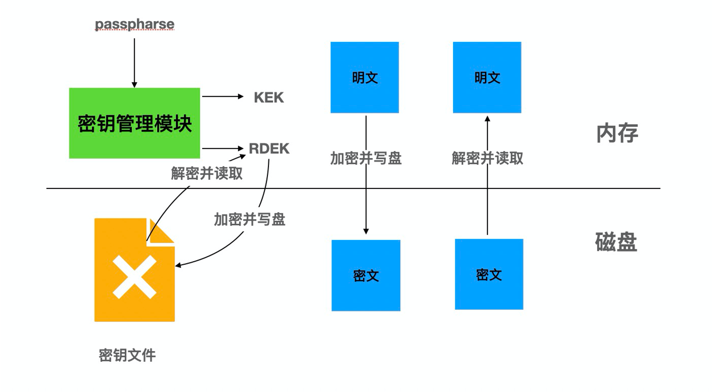
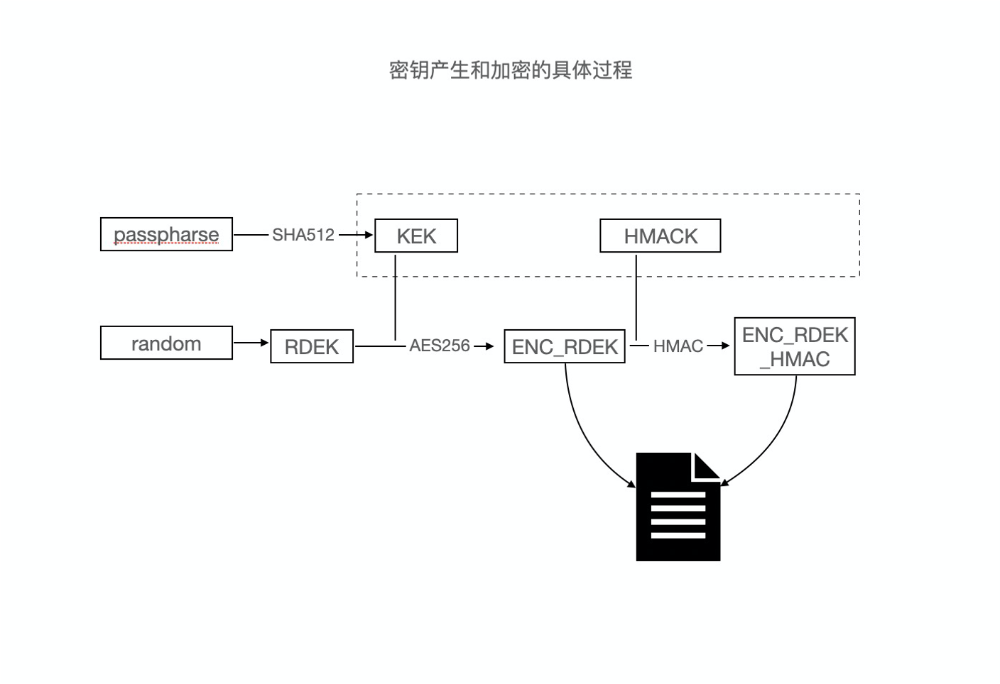
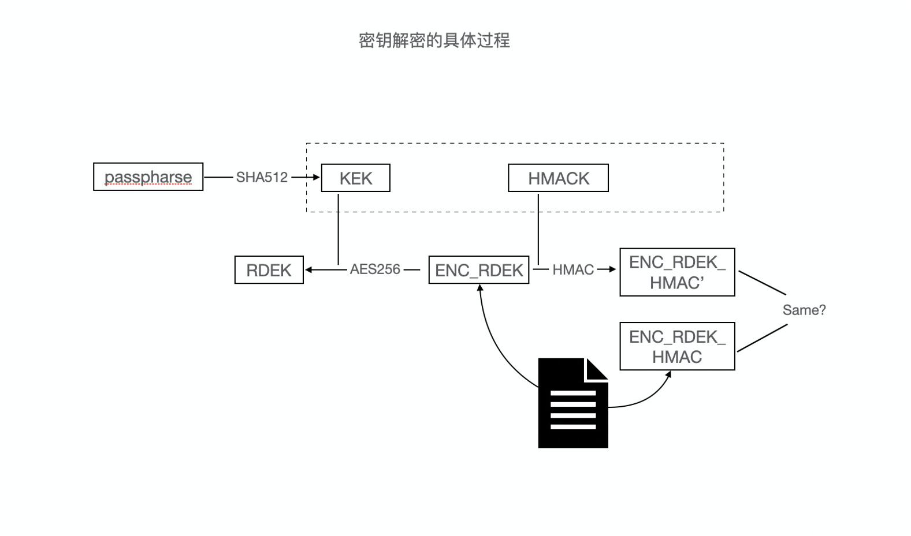
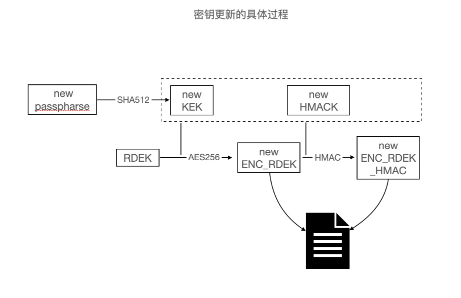

# TDE

## 功能简介

TDE（Transparent Data Encryption，即透明数据加密）通过在数据库层执行静止数据加密，阻止可能的攻击者绕过数据库直接从存储读取敏感信息。经过数据库身份验证的应用和用户可以继续透明地访问应用数据（不需要更改应用代码或配置），而尝试读取数据库文件中敏感数据的操作系统用户以及尝试读取磁盘或备份信息的未经认证的用户将不允许访问明文数据。

为满足支持全集群级别的加密、数据和备份级的加密、AES加密算法、在线密钥更换、阿里云KMS输入密钥等需求，PolarDB for PostgreSQL实现了透明加密功能。

## 实现原理

密钥管理使用双层密钥结构，底层密钥加密数据库数据，顶层密钥加密底层密钥。顶层密钥通过请求外界输入，支持阿里云密钥管理服务。底层密钥通过内核产生后加密存储到密钥文件中。更换密钥只需要更换顶层密钥，更新密钥文件，底层密钥保持不变，可实现在线密钥更换。

对数据库数据使用底层密钥按照页面级别使用AES加密算法，在数据写入磁盘之前进行加密，在数据从磁盘读入内存时进行解密。

数据库数据加密存储在磁盘上，其备份到其他介质上的备份数据也自动是加密状态。

整体构架图如下：



为了实现TDE的功能，内核要实现三个子模块的功能：

- 密钥管理模块：主要实现密钥分配、密钥加密、密钥解密、密钥更换。
- 数据加密模块：主要实现如何加密和加密哪些文件。
- 数据解密模块：主要实现如何进行数据解密。

### 密钥管理模块

密钥管理模块主要实现密钥分配、密钥加密、密钥解密和密钥更换功能。

#### 密钥结构

采用双层密钥结构，两种密钥分别是：

- 表数据加密密钥（Relation Data Encryption Keys，下文统一简称为RDEK）和预写式日志加密密钥（WAL Data Encryption Keys，下文统一简称为WDEK），为双层密钥结构中的底层密钥，用来加密数据和预写式日志。
- 密钥加密密钥（Key Encryption Key，下文统一简称为KEK），为顶层密钥，用来加密底层密钥。

#### 密钥分配

顶层密钥KEK不会持久化存储到磁盘，每次都是通过安全网络外部获取，即运行密钥获取命令获得，这保证了KEK是安全而且无法从存储中泄露。密钥获取命令可以接受任何KMS服务接口命令，测试的时候可以直接通过运行`echo passphrase`获取。运行该命令得到的结果通过安全散列算法（Secure Hash Algorithm ，简称为SHA，包含SHA 256和SHA 512，这里指SHA 512）得到64字节的结果，其中前32字节为KEK，后32字节为底层密钥的消息摘要（下文简称为HMACK）。

底层密钥采用内部的随机数字算法生成，其中根据选择的加密算法的不同，底层密钥的长度不同，如果选择AES-128，则底层密钥为16字节；如果选择AES-256，则底层密钥为32字节。

至此，我们就获取了顶层密钥KEK和其信息摘要HMACK、底层密钥RDEK和WDEK。其中KEK、RDEK和WDEK在数据库运行中会一直保存在共享内存中，其代码中的声明如下：

```c
static keydata_t keyEncKey[TDE_KEK_SIZE];
static keydata_t relEncKey[TDE_MAX_DEK_SIZE];
static keydata_t walEncKey[TDE_MAX_DEK_SIZE];
```

#### 密钥加密

为了能够将底层密钥持久化存储并且保证其安全性，我们需要对其进行加密存储。我们将加密存储后的文件称为密钥文件，其结构如下：

```c
typedef struct KmgrFileData
{
   /* version of the kmgr file*/
   uint32   kmgr_version_no;
   /* Whether the data pages are encrypted? Set it to 0 if encryption is disabled*/
   uint32   data_encryption_cipher;
   /*
    * Wrapped Key information for data encryption
    */
   WrappedEncKeyWithHmac tde_rdek;
   WrappedEncKeyWithHmac tde_wdek;
   /* CRC of all above ... MUST BE LAST!*/
   pg_crc32c crc;
} KmgrFileData;
```

其中，`kmgr_version_no`表示密钥文件的版本号；`data_encryption_cipher`表示使用的数据加密算法，我们会在初始化数据库集群的时候指定具体的数据加密算法，目前支持AES算法且密钥长度为128位或256位；`tde_rdek`表示RDEK加密后的密文加信息摘要；`tde_wdek`表示WDEK加密后的密文加信息摘要；`crc`表示密钥文件的校验值，用于检测密钥文件的完整性。

密钥密文加信息摘要存储在WrappedEncKeyWithHmac结构体中，其字段如下：

```c
typedef struct WrappedEncKeyWithHmac
{
   keydata_t key[TDE_MAX_WRAPPED_DEK_SIZE];
   keydata_t hmac[TDE_HMAC_SIZE];
} WrappedEncKeyWithHmac;
```

其中，`key`表示加密后的密钥，`hmac`表示密钥密文的信息摘要。

RDEK和WDEK都是通过基于AES的密钥封装算法进行封装加密，得到的结果被赋值给WrappedEncKeyWithHmac结构中的key（下文简称为ENC_RDEK 和ENC_WDEK），同时使用密钥分配中得到的HMACK作为密钥使用安全散列算法（Secure Hash Algorithm ，简称为SHA，包含SHA 256和SHA 512，这里指SHA 256）得到对应密钥的密文结果的摘要信息（下文简称为ENC_RDEK_HMAC和ENC_WDEK_HMAC）。

密钥文件在初始化数据库集群的时候产生且被存储在共享存储内，文件位置为global/pg_kmgr。该文件小于512字节，所以可以保证其原子性，不存在部分写的问题。备库通过文件复制进行数据初始化，所以主库和备库是使用相同的密钥进行加密和解密，而主节点和备节点采用同一份共享存储，所以也是使用相同的密钥。

密钥产生和加密的具体过程如下：



#### 密钥解密

在数据库正常启动或崩溃的情况下，可以通过密钥文件解密出对应的底层密钥，其过程如下：

1. 读取密钥文件获取ENC_RDEK、ENC_WDEK、ENC_RDEK_HMAC和ENC_WDEK_HMAC，并通过比较校验值验证文件的完整性。

2. 运行密钥获取命令得到64字节内容，其中前32字节为KEK，后32字节为HMACK。

3. ENC_RDEK和ENC_WDEK以HMACK作为密钥使用SHA 256算法得到的信息摘要ENC_RDEK_HMAC' 和ENC_WDEK_HMAC' ，比较其和步骤1中的ENC_RDEK_HMAC、ENC_WDEK_HMAC是否相同。如果相同，则继续下一步，如果不同则说明密钥获取命令获得的密钥不正确，报错退出。

4. 使用KEK解密ENC_RDEK和ENC_WDEK得到我们需要的密钥RDEK和WDEK。

密钥解密的具体过程如下：



#### 密钥更换

密钥更换可以理解为用新的顶层密钥KEK重新生成新的密钥文件。其过程如下：

1. 运行新的密钥获取命令得到64字节内容，其中前32字节为新的KEK，后32字节为新的HMACK。

2. 对内存中的RDEK和WDEK使用新的KEK进行重新加密，得到的加密结果ENC_RDEK和ENC_WDEK使用新的HMACK重新计算新的摘要信息ENC_RDEK_HMAC和ENC_WDEK_HMAC。

3. 将新的ENC_RDEK、ENC_WDEK、ENC_RDEK_HMAC、ENC_WDEK_HMAC以及校验值组成的KmgrFileData结构生成新的密钥文件中。

可以发现，底层密钥并未发生变化，但是顶层密钥已经更换，该过程完全可以在线操作，对数据库运行状态没有影响。数据库崩溃或者重启之后，数据库会重新读取密钥文件，解密出底层密钥。

密钥更换的具体过程如下：



### 数据加密模块

数据加密模块实现对哪些数据进行加密和如何进行加密，其中涉及加密所有含有用户信息的数据、按照一定粒度进行加密、选择不改变数据大小的加密算法、加密相同的数据得到不同的密文结果和在数据落入磁盘进行加密。

#### 加密文件范围

理论上，所有含有用户数据的数据文件都应进行加密。当前PolarDB中各种文件具体分析如下表：

| 文件名称                                              | 是否含有用户数据 | 文件用途                                         |
| ----------------------------------------------------- | ---------------- | ------------------------------------------------ |
| PG_VERSION                                            | 否               | PolarDB版本兼容PostgreSQL版本号                  |
| **base/NNNNN/NNNNN**                                  | **是**           | **表数据**                                       |
| base/NNNNN/NNNNN_vm                                   | 否               | 可见性判断辅助文件                               |
| base/NNNNN/NNNNN_fsm                                  | 否               | 文件空闲空间文件                                 |
| base/NNNNN/NNNNN_init                                 | 否               | 初始版本文件                                     |
| base/NNNNN/PG_VERSION                                 | 否               | PolarDB版本兼容PostgreSQL版本号                  |
| base/NNNNN/pg_filenode.map                            | 否               | 文件名和表列序列号的对应关系                     |
| base/NNNNN/pg_internal.init                           | 否               | 辅助文件                                         |
| **base/pgsql_tmp/<br />pgsql_tmpPID.tempFileCounter** | **是**           | **排序或者表连接超过工作内存后持久化的临时文件** |
| current_logfiles                                      | 否               | 当前工作的日志文件名                             |
| **global/NNNN**                                       | **是**           | **数据库名和用户名**                             |
| global/NNNN_vm                                        | 否               | 同base/NNNNN/NNNNN_vm                            |
| global/NNNN_fsm                                       | 否               | 同base/NNNNN/NNNNN_fsm                           |
| global/pg_control                                     | 否               | 数据库控制文件                                   |
| global/pg_filenode.map                                | 否               | 同base/NNNNN/pg_filenode.map                     |
| global/pg_internal.init                               | 否               | 同base/NNNNN/pg_internal.init                    |
| pg_commit_ts/0000                                     | 否               | 记录事务提交时间                                 |
| pg_dynshmem/mmap.NNNNNNN                              | 否               | 记录动态内存状态                                 |
| pg_logical/mappings/                                  | 否               | 逻辑订阅的映射关系                               |
| pg_logical/replorigin_checkpoint                      | 否               | 逻辑订阅相关的检查点信息                         |
| pg_logical/snapshots/0-XXXXXXXX.snap                  | 否               | 逻辑订阅的快照信息                               |
| pg_multixact/members/0000                             | 否               | 组合事务的成员信息                               |
| pg_multixact/offsets/0000                             | 否               | 组合事务的偏移信息                               |
| pg_notify/0000                                        | 否               | 通知信息数据                                     |
| pg_replslot/Slotname/state                            | 否               | 复制槽状态文件                                   |
| **pg_replslot/Slotname/xid-NNN-lsn-0-NNNNNNNN.snap**  | **是**           | **逻辑复制解码的用户数据**                       |
| pg_serial/                                            | 否               | 序列信息                                         |
| pg_snapshots/NNNNNNNN-N                               | 否               | 事务快照信息                                     |
| **pg_stat/db_NNNNN.stat**                             | **是**           | **数据库统计信息**                               |
| **pg_stat/global.stat**                               | **是**           | **全局统计信息**                                 |
| **pg_stat_tmp/db_NNNNN.stat**                         | **是**           | **数据库临时统计信息**                           |
| **pg_stat_tmp/global.stat**                           | **是**           | **全局临时统计信息**                             |
| pg_subtrans/0000                                      | 否               | 子事务信息                                       |
| **pg_tblspc/PG_NN_NNNNNNNN/NNNNN**                    | **是**           | **表空间数据文件**                               |
| pg_twophase/NNNNNNNN                                  | 否               | 二阶段事务信息                                   |
| **pg_wal/NNNNNNNNNNNNNNNNNN**                         | **是**           | 预写式日志                                       |
| pg_wal/*.backup                                       | 否               | 预写式日志备份文件                               |
| pg_wal/*.history                                      | 否               | 预写式日志历史文件                               |
| **pg_wal/\*.partial**                                 | **是**           | **预写式日志部分文件**                           |
| pg_wal/archive_status/<br />NNNNNNNNNNNNNNNNNN.done   | 否               | 预写式日志文件归档完成状态文件                   |
| pg_wal/archive_status/<br />NNNNNNNNNNNNNNNNNN.ready  | 否               | 预写式日志文件归档准备就绪状态文件               |
| pg_xact/0000                                          | 否               | 事务信息文件                                     |
| postgresql.auto.conf                                  | 否               | 数据库配置文件                                   |
| postmaster.opts                                       | 否               | 主进程启动参数文件                               |
| postmaster.pid                                        | 否               | 进程号文件                                       |
| postgresql.conf                                       | 否               | 数据库配置文件                                   |
| pg_hba.conf                                           | 否               | 网络配置文件                                     |

其中，上表加粗处理的文件中含有用户数据，可以分为以下六类：

1. 表数据：直接含有用户的敏感数据，必须加密。

2. 临时文件：只是周期性临时存在，可以选择不加密。

3. 共享数据：包含数据库名和用户名，一般敏感程度不高，可以选择不加密。

4. 逻辑复制数据：只有打开逻辑复制才需要进行加密。当前版本为了逻辑复制的目的端的兼容性，暂时不加密。

5. 统计信息：不直接包含用户数据，但是包含用户数据的统计信息，可以选择不加密。但是需要注意某些统计信息对用户来说可能比较敏感。

6. 预写式日志：通过一定的解密可以获取部分的有效数据。当前版本为了复制的目的端的兼容性，暂时不加密，但是会分配预写式日志的加密密钥，即上文中的WDEK，便于后期兼容。

> **注意**：后期如果增加了其他含有用户信息的文件，需要按照和数据页面相同的方式进行加密。

#### 加密方法

目前需要加密的数据每次读取和写入磁盘都是通过页面大小来组织。同样地，我们也选择页面大小粒度来进行加密，这样可以和读写/写入的粒度完全一样，更好组织也更好实现。

为了保证加密前后的数据大小保持一致，我们采用AES算法。同时为了保证相同内容加密的结果不一致，提高安全性，我们在每个页面加密时需要采用不同的初始化向量。目前我们采用的是页面头部信息PageHeaderData中的预写式日志偏移序列号，即pd_lsn和页面的页面号。其中，PageHeaderData的数据结构如下：

```c
typedef struct PageHeaderData
{
   /* XXX LSN is a member of any block, not only page-organized ones */
   PageXLogRecPtr pd_lsn;   /* LSN: next byte after the last byte of the xlog record for last change to this page */
   uint16    pd_checksum; /* checksum */
   uint16    pd_flags;    /* flag bits, see below */
   LocationIndex pd_lower;    /* offset to the start of the free space */
   LocationIndex pd_upper;    /* offset to the end of the free space */
   LocationIndex pd_special;   /* offset to the start of the special space */
   uint16    pd_pagesize_version;
   TransactionId pd_prune_xid; /* oldest prunable XID, or zero if none */
   ItemIdData   pd_linp[FLEXIBLE_ARRAY_MEMBER]; /* line pointer array */
} PageHeaderData;
```

对于每个数据页面来说，其页面头部信息中pd_lsn不能加密，因为该信息要在解密的时候作为初始化变量。除此之外，为了能够表明页面是加密过的，会设置pd_flags对应的标志位0x8000，所以pd_flags也不能加密。同时pd_checksum表示页面的校验值，这个字段会在页面从磁盘中读取时进行页面完整性校验，所以也不能加密。这些未加密的字段都只是数据库内部信息，并不会泄露用户的数据。所以，加密数据页面时并不是页面内容全部进行加密，只需要加密页面头部信息pd_checksum后的部分，前面的部分无需加密。

为了保证磁盘上存储的用户数据都是密文，需要在数据页面写入磁盘之前进行加密，而数据页面在写入磁盘之前必定经过计算校验值的逻辑，即使计算校验值的开关关闭，也会调用对应函数，包括PageSetChecksumCopy和PageSetChecksumInplace函数，所以只要在此之前加密即可保证所有的数据页面在写入磁盘之前均会被加密。

### 数据解密模块

为了保证数据库的正常运行，解密和加密模块采取相同的粒度，采取和加密算法对应的解密算法和密钥，且需要保证页面读入内存时进行解密。

解密时采用的也是数据页面粒度，采用的是AES的解密算法，而密钥是通过内存中获取和加密相同的密钥。

每个数据页面在解密的时候会去检测页面头部信息中的pd_flags中加密标志位是否为1。如果为1，则表明该页面是经过了加密的，否则不是。同时页面头部信息中的pd_lsn和页面号会作为解密时的初始化向量。

和数据页面的加密类似，数据页面读入内存必定经过校验值校验，即使校验值开关关闭，也会调用对应函数，即PageIsVerified函数，所以只要在此之后解密即可保证所有的数据页面在读入内存时均会被解密。

### 适配性设计

- 为了兼容之前的老版本，我们把密钥存储在密钥文件中，而不是控制文件中，使用旧版本的实例可以直接升级内核版本。

- 为了适配各种密钥管理服务，我们增加了`polar_cluster_passphrase_command`参数，可以接受不同密钥服务的命令。

- 为了后期支持预写式日志加密，我们预留了预写式日志的加密密钥。

- 加密模块为了兼容之前的老版本，页面头部信息PageHeaderData中的pd_flags增加是否加密的标志位 0x8000，兼容未加密页面的读写。

### 系统影响

- 加密和解密会增加一定的CPU开销，但经过测试，该功能造成的性能损耗不高于10%。

- 存量实例目前不支持直接从未加密的状态转换为加密的状态。但是当前实现中数据库页面头部信息中支持标记当前页面是否加密，兼容未加密页面的读取和写入。

- 因为启动使用依赖通过外部密钥管理服务来获取加密密钥的密钥，该过程会造成启动耗时。其中，阿里云KMS 对外接口延迟承诺不会超过1s，所以在公有云上该过程耗时不会超过1s。

- 密钥文件通过文件复制给备库进行初始化，所以主库和备库是使用相同的密钥进行数据加密的。即使之后顶层密钥更换，其底层密钥也没有更新，仍然使用相同的密钥进行数据加密。

## 使用方法

您可以通过如下方式使用透明加密功能：

- 指定加密密钥获取命令和加密算法：

  执行初始化集群`initdb`命令时，增加`--cluster-passphrase-command 'xxx' -e aes-256`参数，就会生成支持TDE 的数据库集群。其中`cluster-passphrase-command`参数后面接获取加密密钥的命令，可以是具体的KMS获取明文密钥的接口命令；`-e`参数接数据加密所采用的加密算法，支持AES-128 和AES-256两种，表示密钥为128位和256位的AES算法。

- 更换加密密钥：

  在数据库运行过程中，可以创建插件polar_tde_utils并执行SQL polar_tde_update_kmgr_file (text)来更换TDE的顶层加密密钥，其中`text`参数表示新的获取加密密钥的命令。

- 查看加密信息：

  在数据库运行过程中，可以创建插件polar_tde_utils并执行SQL命令`select polar_tde_kmgr_info_view ()`来查看密钥文件信息，主要包括密钥文件版本、密钥密文。

- 检查密钥文件是否正确：

  在数据库运行过程中，可以创建插件polar_tde_utils并执行SQL命令`select polar_tde_check_kmgr_file ()`来检查密钥文件和内存中密钥是否一致，如果一致则返回true，否则返回false。
