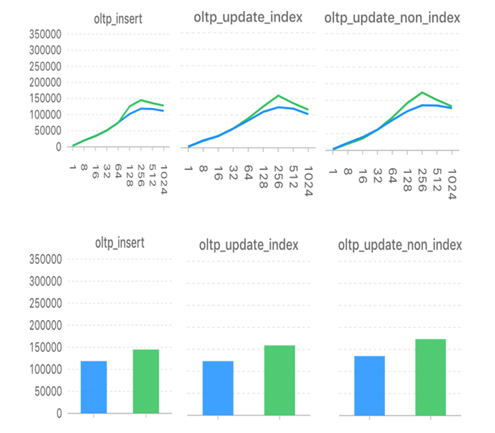
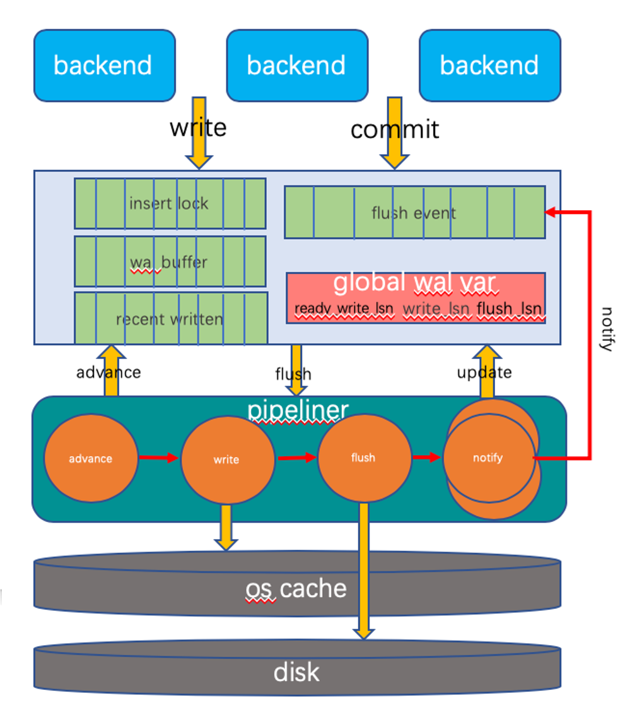
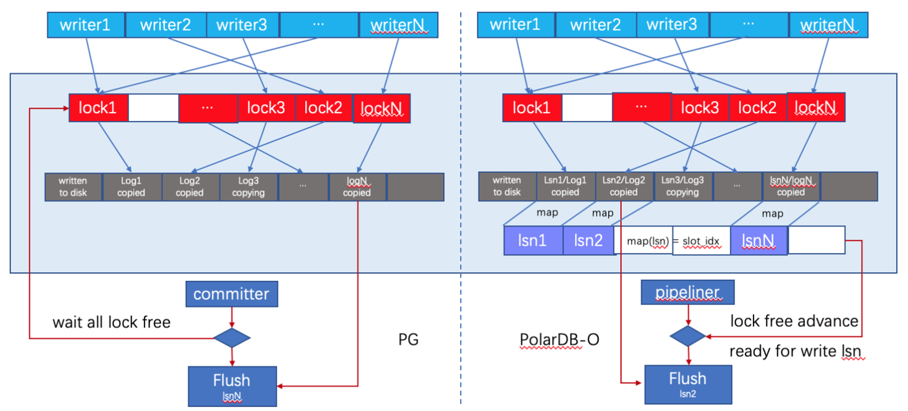
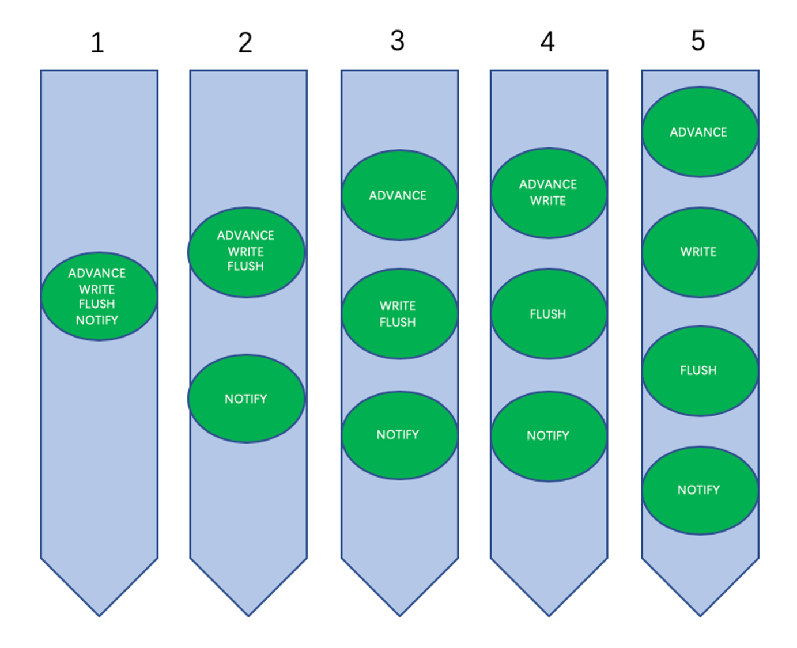

# WAL Pipeline

## 功能简介

WAL流水线优化将数据库事务日志提交流程拆分为若干子阶段，每个子阶段像CPU流水线机制一样独立运行，提升数据库实例处理事务的吞吐量。

经测试，sysbench测试工具insert/update_index/update_non_index三个场景下，可伸缩性由64并发提高到256并发，TPS峰值性能提高22%～29%。



## 实现原理

### WAL流水线架构



- 事务日志写入（backend进程）
  1. 从insert lock数组中独占获取WALInsertLock
  2. 计算WAL写入LSN
  3. 并行写入WAL buffer


- 事务日志提交（backend进程）
  1. 根据提交LSN计算flush event槽
  2. 在flush event槽中等待唤醒


- 事务日志回刷 
  1. advance线程通过recent written数组无锁计算并更新ready_written_lsn全局变量
  2. write线程将wal buffer中write_lsn与ready_written_lsn之间的事务日志写入OS缓存并更新write_lsn
  3. flush线程将flush_lsn与write_lsn之间的事务日志落盘并更新flush_lsn
  4. notify线程通过flush event数组唤醒flush_lsn之前的所有等待提交的用户进程


###  无锁空洞检测



与原生PostgreSQL相比，PolarDB pipeline WAL回刷连续日志采用了无锁的方式，无需等待insert lock数组中所有的slot都加锁成功，只要有连续的WAL日志即可发起回刷操作（需要考虑合适的能够触发回刷操作的最小连续日志空间）。

### 可变工作模式流水线

4级流水线可以有如下5种有效的组合模式，分别适用于不同的场景：



- 不支持fsync（共享存储）
  - 工作模式1：低并发
  - 工作模式2：缺省模式
  - 工作模式3：高并发

- 支持fsync（本地盘）
  - 工作模式4：缺省模式
  - 工作模式5：高并发


## 使用方法

要开启WAL Pipeline，请配置以下参数并重启实例。

```
polar_wal_pipeline_enable = true
polar_wal_pipeline_mode = 2 (1~5)
```

